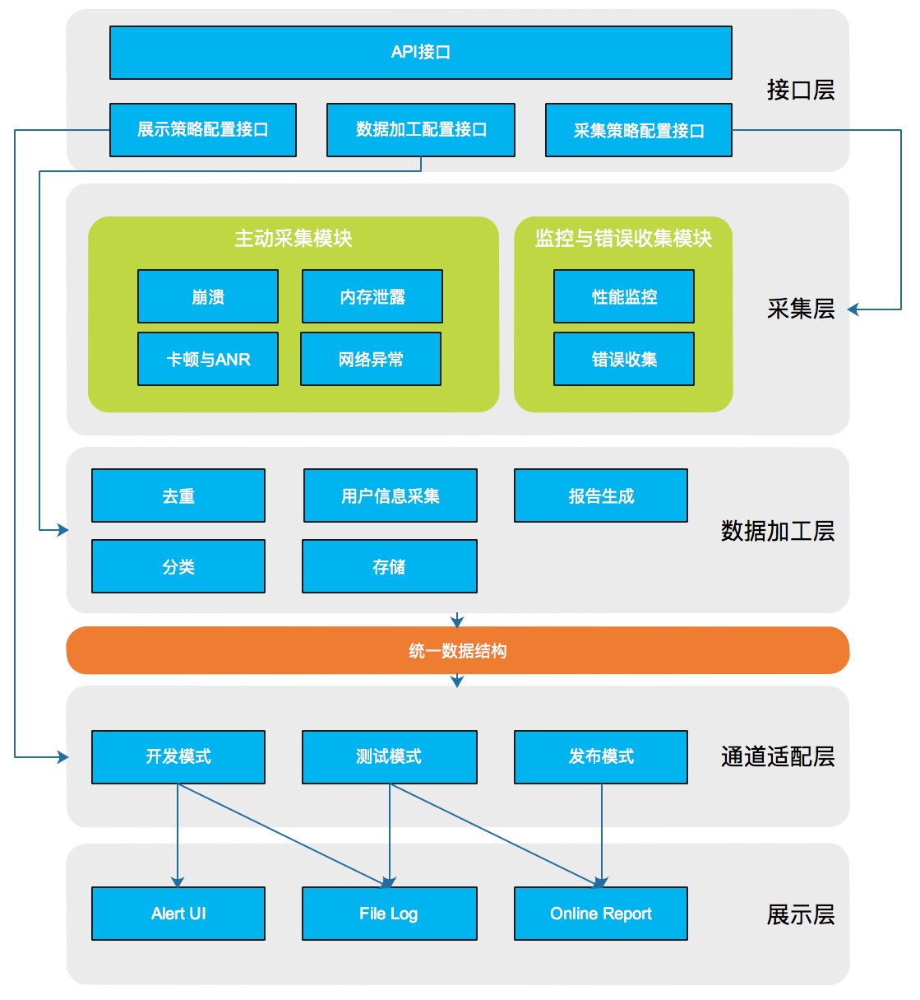
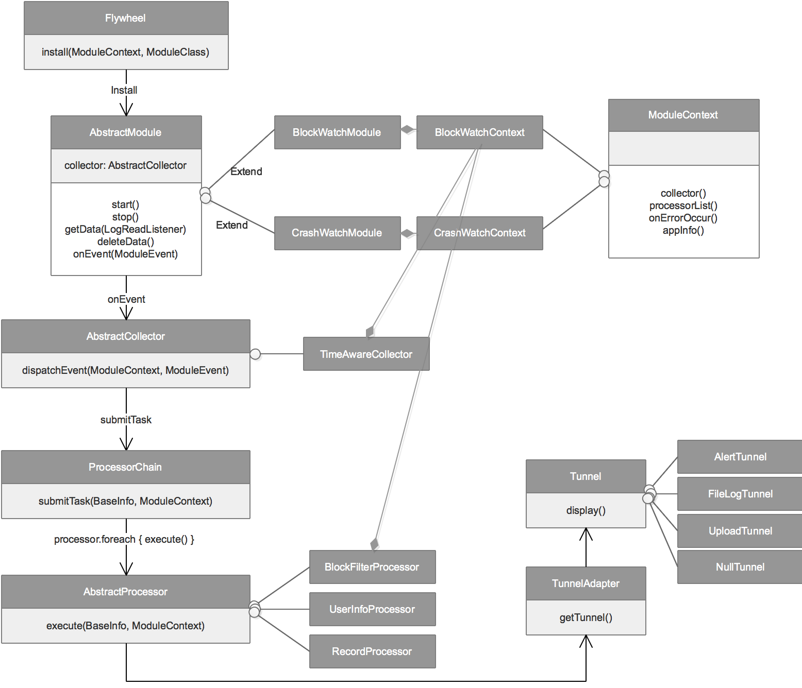
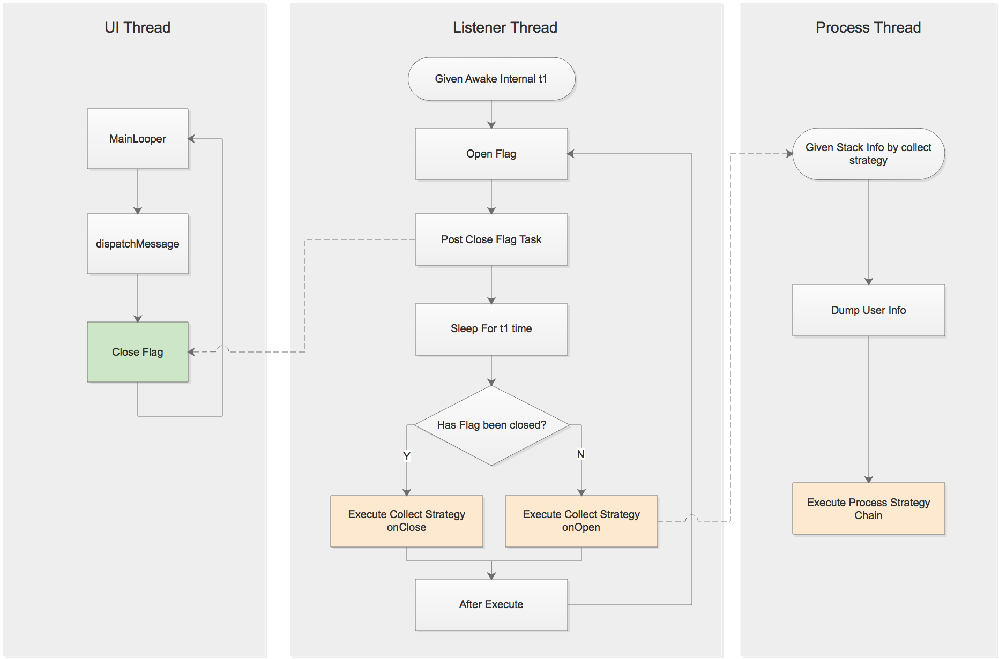
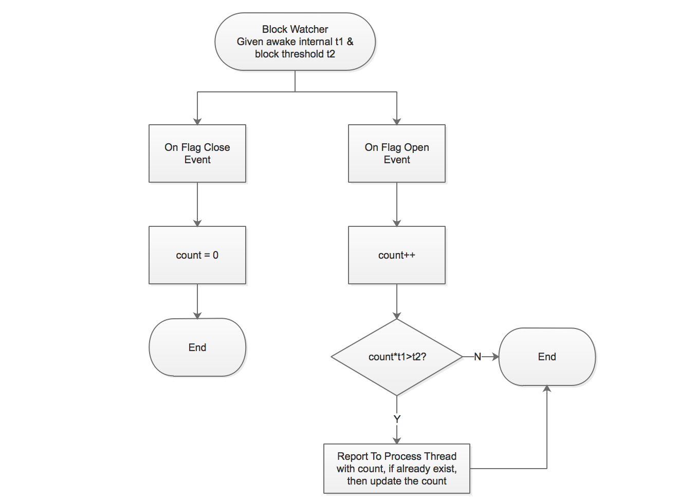

# Flywheel：基于Kotlin的模块化APM框架
### ---- A Modularization Designed APM Framework using Kotlin

## 1. introduction

### 解决的问题

客户端线上性能监控是客户端开发中的一大难题，业内有许多专注于提供应用性能监控的企业，也有一些企业公布过自己的监控方案，但目前始终没有一个成熟的开源方案。Flywheel致力于提供一个完善的开源线上性能监测解决方案。

### 优势

1. 高度可定制化：为了满足不同业务的定制化需求，Flywheel设计遵循了可插拔原则，用户可根据需求编译，安装，配置，使用对应的模块。并且对于每个独立模块的采集策略，数据处理策略，上传策略，我们都尽可能地开放了可扩展的接口。

2. 支持各种性能问题的检测：App的性能问题大致包括崩溃、UI卡顿或者ANR、网络请求错误或超时、流量消耗大、耗电量异常这几类。针对每一类问题，Flywheel提供了对应的监测模块，目前已经支持的模块有：

	1. 卡顿与ANR检测：BlockWatcher
	2. 崩溃检测：CrashWatcher
	3. 内存泄露检测：LeakWatcher
	4. 性能监控：RuntimeMonitor
	5. 异常日志收集：ExceptionCollector

3. 卡顿监控方案相比其它方案性能、内存消耗更低，同时解决了线程唤醒监控方案无法检测卡顿时长的问题。

### 总体框架

Flywheel的架构如下图所示，总共分为五层。



**第一层**为接口层，提供模块API调用，以及三类策略的配置接口。其中采集策略决定了模块如何进行采集，比如采集阈值、唤醒间隔等，数据加工策略决定了采集到数据后如何进行加工处理，比如去重、分类、过滤等，展示策略则决定了不同模式下如何展示给开发者。

**第二层**为采集层，采集层囊括了目前Flywheel所支持的功能模块，主要分为两部分，一部分是主动采集模块，包括崩溃收集、UI卡顿与ANR检测、内存泄露检测、网络与流量异常检测，这些模块可以主动发现异常问题，并且无需侵入代码、性能消耗低；另一部分是监控与错误收集模块，监控模块需要长时间占用线程，性能消耗高，错误收集模块是提供给用户记录自定义问题的接口，需要侵入代码。对于每一种采集模块，可以通过采集策略配置接口配置独立的采集策略，也可以使用预置的策略。

**第三层**为数据加工层，该层负责对采集完的数据进行进一步加工，例如崩溃信息去重、卡顿分类、异常流量过滤、性能报告生成等等。同样的，每种模块都可以配置自己的数据处理责任链。

**第四层**是通道适配层，用于根据不同的产品模式适配对应的展示逻辑，通道适配层可以帮助开发者更加灵活的决定数据如何被展现，同时也隔离了数据与UI的耦合。

**第五层**是展示层，展示层提供了不同的数据展示方式，并且可以组合使用。目前Flywheel内置三种展示方式，分别是Alert UI，File Log, Online Report。

这种分层设计的一个主要考量是我们希望Flywheel中的每一种策略，每一个模块都是可配置可扩展的。最终目标是Flywheel可以做到极致的灵活性，对于不同的业务需求实现**完全自定义**的监控方案。

**Flywheel框架与执行流程如下图所示：**


## 2. BlockWatcher

目前业界的线上卡顿检测方案有两种，一种是通过`handler.setLogPrinter()`监控主线程`dispatchMessage`执行时长，另一种是使用一个`DaemonThread`每隔一定时间唤醒并往主线程post一个任务，如果这个任务在下一次唤醒时没有执行，说明主线程发生了卡顿。

目前两种方案各有利弊，第一种方案无法实现对OnTouch事件中的卡顿进行检测（touch事件的处理在`MessageQueue.next()`函数中，而非`dispatchMessage()`函数中，`LogPrinter`的执行是在`dispatchMessage()`前后，因此对touch事件无能为力）。此外第一种方案的检测依赖于主线程最终能够执行完`dispatchMessage()`，因此对于真正的ANR也无法检测。第二种方案在检测全面性上优于前者，但是也存在两个问题，一是需要一个额外的长期存在的线程，相对来说更耗资源，二是这种方案只能检测到发生了卡顿，无法得知这个卡顿持续了多久。

**Flywheel.BlockWatcher**在第二种方案基础上进行了完善，使其能够粗略的评估卡顿时间的长短（事实上，卡顿持续时间并没有很高的精度要求）。

BlockWatcher检测卡顿的流程图如下：



除了上述的策略以外，BlockWatcher还预置了如下几种策略，供扩展：

1. **去重策略：**
	
	卡顿信息的堆栈和崩溃信息的堆栈有一个比较大的区别：针对同一个卡顿它的堆栈信息可能不一定相同。考虑如下代码，这段代码的卡顿最内层堆栈可能是第三行，也可能是第五行，但是本质上他们是同一个问题。此外，某些卡顿可能是系统API调用引起，此时我们只想关注我们的项目的调用代码，不想关注系统内部的执行。因此简单的使用堆栈的hashcode进行去重不太合适。	
	
	```
	public void block() {
		for (int i=0;i<100000;i++) {
			int x = 1000/i;
			for (int j=0;j<1000000;j++) {
				int y = 1000/j;
			}
		}
	}
	```	
	
	Flywheel提供了一种更细致的去重策略，首先选取堆栈信息中含应用自身包名的调用栈，同时会设置一个过滤类名单，这个名单里包含了一些基础库操作，如果这些调用栈里的最内层堆栈的类在过滤名单中，则也去除。最后将剩下堆栈信息进行hashcode，作为这次卡顿的唯一标识。

2. **采集策略+分类策略：**

	如上文所提，通过`DaemonThread`的方案无法得知卡顿持续了多久，Flywheel提供了一种策略来解决这个问题：**多次唤醒+次数记录**。策略的大致流程图如下：
	
	

	通过这种策略，我们可以将卡顿划分各个时长区间，比如1-2秒，2-3秒，3-5秒，5秒以上，这种分类可以帮助我们更好的确定问题的严重性与优先级。
	
	此外，对于同一个卡顿，可能每次的卡顿时间都不太一样，客户端可以记录下所有的卡顿时间，上传到服务器端后做进一步分类。


## 3. CrashWatcher

崩溃捕获，包括dalvik层崩溃与native层崩溃。目前Flywheel中dalvik层崩溃捕获通过`Thread.setDefaultUncaughtExceptionHandler`接口完成，native层崩溃捕获基于手百的so库完成，该库的实现思路类似Google的breakpad。

由于同一种崩溃的调用栈是固定的，因此Flywheel所提供的崩溃去重策略是对整个堆栈信息取hashcode进行去重。

## 4. LeakWatcher

Flywheel集成了LeakCanary内存泄露检测功能。LeakWatcher是对LeakCanary的进一步封装，功能上没有本质改变。

## 5. ExceptionCollector

ExceptionCollector是向用户提供的异常信息或者自定义日志信息收集接口。开发者可以将Catch住的异常信息通过这个接口提交到Flywheel，以享受到后续的去重、分类、过滤、存储等统一处理流程。

## 6. RuntimeMonitor（敬请期待）


## 7. NetWatcher（敬请期待）

## 8. 数据加工责任链

Flywheel的数据加工层采用责任链模式，每个模块都可以配置一个或多个加工策略，这些加工策略有先后处理顺序，同时每个策略还会决定后续的策略是否要执行。

## 9. 通道适配与展示

目前Flywheel支持三种通道模式：开发模式、测试模式、发布模式，以及三种展示方式：警告视图、文件记录、日志上传。开发者可以添加自己的通道模式与展示方式，并进行匹配。比如增加灰度模式以上传更详细的日志。
