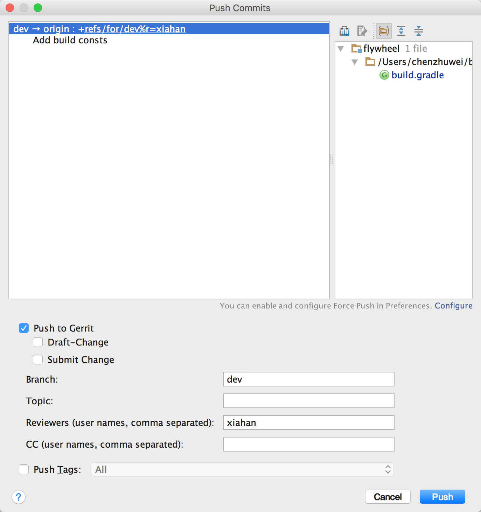

# ICode 使用文档

#### 注：本文档默认库已经创建完毕，master/dev分支都存在，适合普通开发过程中使用。

## 准备工作

- 克隆并安装hook(这两条命令可以在icode上，克隆代码库按钮里看到)

```
git clone ssh://{Your Baidu ID}@icode.baidu.com:8235/baidu/inputmethod/{ProjectName} baidu/inputmethod/{ProjectName} && scp -p -P 8235 {Your Baidu ID}@icode.baidu.com:hooks/commit-msg baidu/inputmethod/{ProjectName}/.git/hooks/
 
git rev-parse --git-dir | read groot; scp -p -P 8235 {Your Baidu ID}@icode.baidu.com:hooks/commit-msg $(git rev-parse --git-dir)/hooks
``` 

- 配置GPUSH

```
git config --global alias.gpush '!f() { : push ; r=$1; [[ -z $r ]] && r=origin; b=$2; t=$(awk "{ print \$2 }" $(git rev-parse --git-dir)/HEAD); t=${t#refs/heads/}; [[ -z $b ]] && b=$t; cmd="git push $r HEAD:refs/for/$b%topic=$t"; echo $cmd; echo; $cmd; }; f'
```

- 切换到`dev`分支（**禁止对master分支作任何改动**）

```
git checkout dev
```

- 创建一个你的分支，并切换到该分支

```
git branch czw
git checkout czw
```

## 开始开发

1. 每次开发前切换到dev分支`git checkout dev`，执行`git pull`，拉取最新代码。切换到自己的分支`git checkout czw`，合并dev的代码`git merge dev`，解决可能存在的冲突，冲突解决见后文。
2. *Coding...*
3. 完成一次coding，执行`git add `/`git commit`进行提交。
4. 如果完成一个功能开发，转5，否则转1。
5. 切换到`dev`分支`git checkout dev`，并拉取最新代码`git pull`。
6. 将自己分支上提交的代码合并到dev上，并将所有提交合并成一个提交，`git merge --squash czw`，
7. 此时可能存在冲突，进行冲突解决。解决完成后进行提交`git commit –a`。此时git会自动增加commit信息，但是我们需要再增加一个title来说明提交的功能情况。冲突解决见下文。
8. 将merge完成的dev推送到icode上，执行`git gpush`。执行完成后将会产生一个评审。
9. 评审人审批该次提交，如果不存在问题则在icode上点击合入，完成开发，转11。否则点击0，-1，-2驳回，转10。
10. 对于不合格的提交告知提交者进行修改。提交者在dev分支上进行修改或者重构，完成后执行`git add`/`git commit --amend`提交，再执行`git gpush`，然后转9。**这里在提交历史上会出现两次提交记录，如何合并成一次？需要和ICode方确认**。
11. 完成dev开发后，再次执行`git pull`拉取最新代码，然后切换到自己的分支`git checkout czw`，执行`git merge dev`。

## 冲突处理

当两条分支对同一个文件的同一个文本块进行了不同的修改，并试图合并时，Git不能自动合并的，称之为冲突(conflict)。解决冲突需要人工处理。

假设当前在dev分支，想把czw分支merge过来，结果产生了一个冲突，打开文件内容可以看到这么一个冲突：

```
<<<<<<< HEAD

test in master

=======

test in dev

>>>>>>> dev
```
  
`<<<<<<<`标记冲突开始，后面跟的是当前分支中的内容。

`HEAD`指向当前分支末梢的提交。

`=======`之后，`>>>>>>>`之前是要merge过来的另一条分支上的代码。

`>>>>>>>`之后的dev是该分支的名字。

对于简单的合并，手工编辑，然后去掉这些标记，最后像往常的提交一样先add再commit即可。

## 去除多余的merge branch

开发过程中有时候pull最新的代码，或者将自己的代码merge到`dev`分支上时会出现类似如下的一个commit：

```
commit 55e1030cf179a1560084f3cc96558f96e7012938
Merge: f2e6889 62907b1
Author: chenzhuwei <czwcarelife@gmail.com>
Date:   Mon Nov 14 16:35:43 2016 +0800

    Merge branch 'dev' of ssh://icode.baidu.com:8235/baidu/inputmethod/androidtest into dev
```

这种commit其实在多数情况下是不需要的，因此如果出现这种情况的话，在执行`git gpush`之前先执行：

```
git rebase origin/{当前分支，通常是dev分支}
```


## Android Studio下使用Gerrit插件

由于ICode的评审机制是基于gerrit的，因此可以直接使用Gerrit发起评审。配合Android Studio自带的Git插件，可以完成上述所有命令行里的功能。

#### gerrit插件安装

Plugin下搜索gerrit，install之后重启IDE即可。

#### 使用gerrit发起评审（替代git gpush）

完成Commit后，点击VCS -> Git -> Push弹出Push界面如下，其实Topic无需填写，其余按提示即可：



## FAQ