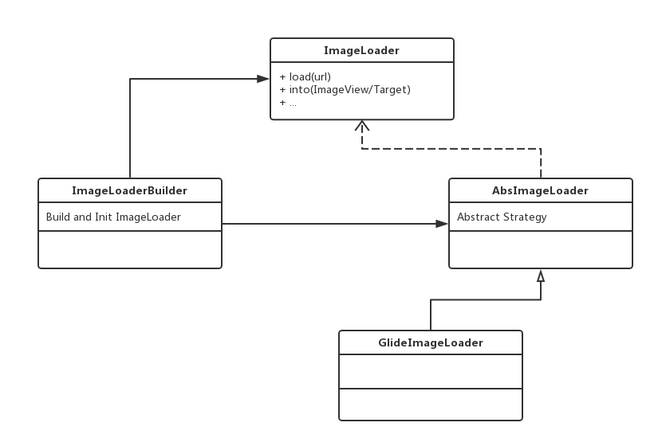

# Android 图片加载框架对比分析

## 1. 现有框架
1. Picasso
2. Glide
3. Fresco
4. Universal Image Loader

## 2. 功能特性介绍

### Picasso
- 轻量级
- API设计优雅

### Glide
- 内存低于Picasso（根据View尺寸进行缓存，采用RGB565，Picasso为全尺寸缓存，ARGB8888）
- 加载速度高于Picasso （无须再次裁剪）
- 支持Gif格式
- API模仿Picasso

### Fresco
- 4.4或以前存储在Ashmem中，5.0以后安卓默认都存储在Ashmem中
- 支持WebP格式
- 支持Gif格式
- 渐进式加载
- 更强大的DraweesView
- 管道式设计
- 2级内存缓存+1级磁盘缓存
- API设计类似RXJAVA

### UIL
- 轻量级
- 框架清晰，适合自定义，（目前百度输入法的ImageFetcher应该是基于某一个版本改动而来的）

### 功能对比结果： Fresco > Glide > Picasso = UIL

## 3. 性能测试

### 3.1. 静态指标

Name    | Current Version | Last Update | Size of jar |　Methods Num
:------:|:---------------:|:-----------:|:-----------:|:----------:|
Picasso | 2.5.2           | 2016/8/9    | 52k         | 849
Glide   | 3.7.0           | 2016/9/12   | 172k        | 2879
Fresco  | 0.13.0          | 2016/9/13   | 265k        | 4981
UIL     | 1.9.5           | 2016/1/26   | 68k         | 1206

此外Picasso, Glide, Fresco若要配合okhttp使用则还需要额外150k左右的jar包，方法数2182

### 3.2. 图片加载速度

#### 3.2.1 网络加载速度

1. 使用34张不同的图片，采用并行方案，统计平均加载时间。重复3次。
2. 均配合OKHttp3作为底层网络库。

Good Network (图片来自 http://i.imgur.com/。大小在100K+)

Fresco存在一个Native Heap的缓存，即使关闭了内存缓存和磁盘缓存，仍然可能有些图片会被缓存起来，因此平均时间偏快。

Name    | Try Times | Average Load Time
:------:|:---------:|:----------------:|
Picasso |    102    | (1301+935+1280)/3 = 1172ms
Glide   |    102    | (735+1040+793)/3 = 856ms
Fresco  |    102    | (648+689+808)/3 = 715ms
UIL     |    102    | (2307+1762+2322)/3 = 2130ms

Poor Network *// TODO*

Name    | Try Times | Average Load Time
:------:|:---------:|:----------------:|
Picasso |    102    | 
Glide   |    102    | 
Fresco  |    102    | 
UIL     |    102    | 

#### 3.2.2 本地缓存加载速度

1. 使用34张不同的图片，采用并行方案，统计平均加载时间。
2. 内存缓存为系统可以缓存的1/4，磁盘缓存都是50M
3. 保证图片都已缓存到本地，改变图片加载顺序让其随机出现

仅磁盘缓存

Name    | Try Times | Average Load Time
:------:|:---------:|:----------------:|
Picasso |    34     | 233 ms
Glide   |    34     | 48 ms
Fresco  |    34     | 46 ms
UIL     |    34     | 31 ms

配合内存缓存（对同一张图片加载3次）

Name    | Try Times | Average Load Time
:------:|:---------:|:----------------:|
Picasso |    102    | 84 ms
Glide   |    102    | 16 ms
Fresco  |    102    | 16 ms
UIL     |    102    | 14 ms

### 3.3. 内存占用

1. 使用34张不同的图片，每张图片显示3次
2. 图片格式均为ARGB4444或者RGB565

Name    | Image Num | Memory Usage
:------:|:---------:|:----------------:|
Picasso |    34     | 43M
Glide   |    34     | 20M
Fresco  |    34     | 15M
UIL     |    34     | 27M

### 3.4. 大图片加载

1. 图片大小为1M和4M
2. 图片质量为ARGB8888
3. 图片显示占满整个屏幕
4. 测试是否可以加载
5. 测试加载速度
6. 测试内存占用

**1M**

Name    | Can Load | Time 1st | Time Cache | Memory 1st | Memory Cache
:------:|:--------:|:--------:|:----------:|:----------:|:----------:|
Picasso | Y        | 6422 ms  | 2320 ms    | 40M        | 39M
Glide   | Y        | 13200 ms | 128 ms     | 39M        | 8M
Fresco  | Y        | 5547 ms  | 155 ms     | 31M        | 31M
UIL     | Y        | 6545 ms  | 115 ms     | 8M         | 8M

**4M**

Name    | Can Load | Time 1st | Time Cache | Memory 1st | Memory Cache
:------:|:--------:|:--------:|:----------:|:----------:|:----------:|
Picasso | Y        | 18429 ms | 2302 ms    | 45M        | 8M
Glide   | Y        | 33025 ms | 323 ms     | 62M        | 8M
Fresco  | Y        | 9715 ms  | 296 ms     | 31M        | 31M
UIL     | Y        | 13684 ms | 254 ms     | 8M         | 8M

### 3.5. Gif加载与性能

1. Gif图片大小为1.7M
2. 图片质量为ARGB8888
3. 图片显示占满整个屏幕
4. 图片来自国外站点

Name    | Time 1st | Time Cache | Memory 1st | Memory Cache
:------:|:--------:|:----------:|:----------:|:----------:|
Glide   | 233585ms | 524 ms     | 60M        | 60M
Fresco  | Fail     | Fail       | Fail       | Fail

该测试问题可能来源于网络情况不好，Fail原因未知。

1. Gif图片大小为1M
2. 图片质量为RGB565
3. 图片显示1/4个屏幕
4. 图片来自国内站点

Name    | Time 1st | Time Cache | Memory 1st | Memory Cache
:------:|:--------:|:----------:|:----------:|:----------:|
Glide   | 11466 ms | 146 ms     | 30M        | 30M
Fresco  | 306 ms   | 107 ms     | 28M        | 28M

### 性能对比结果： Fresco > Glide > UIL > Picasso

## 4. 其它

### 4.1. 使用难易程度

Glide与Picasso的API类似，采用链式调用，Glide加载图片代码如下：

	Glide.with(getContext())
		.load(url)
       .listener(mRequestListener)//配置监听器
       .placeholder(Drawables.sPlaceholderDrawable)
       .error(Drawables.sErrorDrawable)
       .centerCrop()
       //.skipMemoryCache(true) //不使用内存缓存
       //.diskCacheStrategy(DiskCacheStrategy.NONE) //不使用硬盘缓存
       .into(mImageView);

UIL接口更为传统，配置采用Builder模式：
	
	mImageOptions = new DisplayImageOptions.Builder()
		.showImageOnLoading(Drawables.sPlaceholderDrawable)
       .showImageOnFail(Drawables.sErrorDrawable)
       .bitmapConfig(Bitmap.Config.ARGB_8888)
       .cacheInMemory(true) //不使用内存缓存
       .cacheOnDisk(true)  //不使用硬盘缓存
       .build();
    mImageLoader.displayImage(url, mImageView, mImageOptions);

Fresco需要配合自定义的DraweeView加载图片，不兼容ImageView

	DraweeController draweeController = Fresco.newDraweeControllerBuilder()
		.setOldController(mImageView.getController())
		.setControllerListener(mImageView.getControllerListener())
		.setUri(Uri.parse(url))
		.build();
	mImageView.setController(draweeController);

### 综上而言，API使用难易程度上 Glide = Picasso > UIL > Fresco

### 4.2. 扩展难易程度

这四个库都是组件化设计，模块可插拔。
相对来说UIL的扩展与自定义最容易，Glide，Fresco次之，Picasso最次

### 4.3. 国外网友的一个评价图

## 5. 源码分析

### Picasso

https://github.com/chenzhu33/HippoW/blob/master/imageloader/SourceCode_Picasso.md

### Glide

https://github.com/chenzhu33/HippoW/blob/master/imageloader/SourceCode_Glide.md

### Fresco

https://github.com/chenzhu33/HippoW/blob/master/imageloader/SourceCode_Fresco.md

### UIL

https://github.com/chenzhu33/HippoW/blob/master/imageloader/SourceCode_UIL.md

## 6. 选择与封装

#### 选择：

1. 综上所述可以排除UIL（长时间不维护）与Picasso（性能问题）。
2. Glide与Fresco相比，Fresco在性能与功能上都更为强大，但是包体积大，且基于DraweeView，而非ImageView。

#### 封装：

关于封装，如果长期不考虑Fresco,可以使用如下的方式封装：

如果考虑Fresco,封装方式为：修改Fresco,只使用它的bitmap层，放弃Drawee以及相关功能，这样封装同上图。
但是这种方式也丢失了Fresco的许多特性。