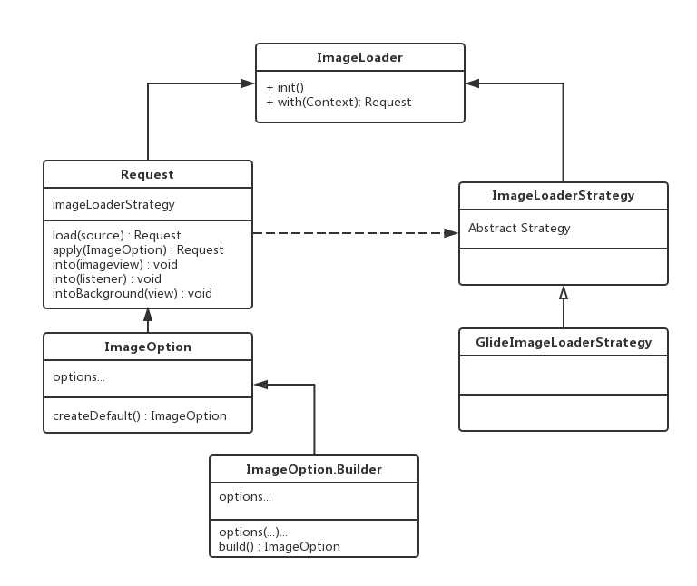

# ImageLoader Introduction

## ImageLoader框架

开发ImageLoader的原因如下：

1. 为上层提供更简单的API调用，隔离第三方框架较为复杂的配置。
2. 隔离第三方框架具体实现，方便以后替换其它库

基于上述两点，ImageLoader设计原则是API最小化以及完全隔离第三方框架。总体框架如下：



ImageLoader类对外提供调用接口，Request类负责组建请求，ImageOption类创建相关配置，这三个类开放给用户。

ImageLoaderStrategy提供了图片加载的接口，其实现为第三方图片加载器，如图中的GlideImageLoaderStrategy。这两个类不暴露给用户。

这种设计完全隔离用户对第三方图片加载库的感知。同时保持了API简洁性，其最简调用如下：

```
ImageLoader.with(context).load(url).into(imageview);
```

## API使用文档

ImageLoader的使用分为初始化和图片加载两部分。初始化在`Application`中执行：

```
ImageLoader.init();
```

图片加载使用`ImageLoader.with(context)`获得请求接口

**注意：在非Activity界面中尽量使用Application Context，在App化中使用activity的context**

### 图片加载部分

#### 资源来源：load(Object source)

**普通图片加载：**

```
ImageLoader.with(context).load(url).into(imageview);
```

**内置资源Id：**

```
ImageLoader.with(context).load(R.drawable.icon).into(imageview);
```

#### 图片目标：into(...)

**加载到ImageView**

```
ImageLoader.with(context).load(url).into(imageview);
```

**加载到View.Background**

```
ImageLoader.with(context).load(url).intoBackground(view);
```

**加载到Listener**

```
ImageLoader.with(context).load(url).into(listener);

ImageLoadListener listener = new ImageLoadListener {
    public void onSuccess(Drawable drawable) {
    
    }
    
    public void onFail(Drawable errorDrawable) {
    
    }
}
```

**下载资源**

```
ImageLoader.with(context).load(url).downloadOnly(listener);

ImageDownloadListener listener = new ImageDownloadListener {
	public void onSuccess(File file) {
	
	}
	
	public void onFail(Exception e) {
	}
}
```

#### 图片配置：

```
ImageLoader.with(context).load(...).apply(imageoption).into(...)
```

**创建默认配置**

使用默认配置时可以省略`apply(...)`调用。也可以使用`apply(ImageOption.createDefault())`。默认配置参数如下：

```
private boolean cacheInMemory = true; // 使用内存缓存
private boolean cacheInDisk = true; // 使用磁盘缓存
private boolean fadeIn = true; // 使用渐现alpha动画
private Priority priority = Priority.NORMAL; // 正常优先级
private int width = 0; // 不改变宽度
private int height = 0; // 不改变高度
private ScaleType scaleType = ScaleType.FIT_CENTER; // 图片缩放
private ScaleType placeholderScaleType = ScaleType.CENTER_INSIDE; // 占位图缩放
private ScaleType errorScaleType = ScaleType.CENTER_INSIDE; // 错误图缩放

private int placeholderId = -1; // 无占位图
private Drawable placeholderDrawable = null; // 无占位图
private int errorId = -1; // 无错误图
private Drawable errorDrawable = null; // 无错误图

private Map<String, String> httpHeaders = new HashMap<>(); // 无HttpHeader
```

**禁止 内存/磁盘缓存**

```
ImageOption.Builder = new ImageOption.Builder()
	.skipMemoryCache()
	.skipDiskCache()
	.build();
```

**禁止 FadeIn动画**

```
ImageOption.Builder = new ImageOption.Builder()
	.dontAnim()
	.build();
```

**改变图片宽高**

```
ImageOption.Builder = new ImageOption.Builder()
	.override(width, height)
	.build();
```

**任务优先级**

该设置只会尽量依据该优先级，不能确保一定高优先级的比低优先级的先执行完成

```
ImageOption.Builder = new ImageOption.Builder()
	.priority(Priority.HIGH) 
	.build();
```

**占位图 / 错误图**

同时设置id和drawable时，id的优先级更高

```
ImageOption.Builder = new ImageOption.Builder()
	.placeholder(R.id.placeholder)
	.placeholder(drawable)
	.error(R.id.error)
	.error(drawable)
	.build();
```

**缩放**

目前只支持`FIT_CENTER`,`CENTER_INSIDE`,`CENTER_CROP`。
注：对于ImageView的情况增加支持`FIT_XY`，但是不建议使用。

```
ImageOption.Builder = new ImageOption.Builder()
	.scaleType(Image.ScaleType.FIT_CENTER)
	.placeholderScaleTye(Image.ScaleType.CENTER_INSIDE)
	.errorScaleTye(Image.ScaleType.CENTER_CROP)
	.build();
```

**HttpHeader**

```
ImageOption.Builder = new ImageOption.Builder()
	.addHeader(key1, value1) 
	.addHeader(key2, value2) 
	.build();
```


#### 缩略图请求

ImageLoader支持缩略图请求加载，应用场景一般在大图加载前预先加载小图：

```
Request thumbnailRequest = ImageLoader.with(context)
	.load(thumbnailUrl)
	.apply(option);

ImageLoader.with(context)
	.load(url)
	.thumbnail(thumbnailRequest)
	.apply(option)
	.into(imageview)
```

注意：缩略图请求仅对into(ImageView)有效果，

#### 额外监听器

使用into(ImageView)或者intoBackground(View)的情况下，支持添加额外监听器：

```
ImageLoadListener listener = new ImageLoadListener {
    public void onSuccess(Drawable drawable) {
    
    }
    
    public void onFail(Drawable errorDrawable) {
    
    }
}

ImageLoader.with(context)
	.load(url)
	.apply(option)
	.addListener(listener)
	.into(imageview)
```

#### 任务管理

**清除缓存**

```
ImageLoader.clearMemoryCache(context);
ImageLoader.clearDiskCache(context);
```

**取消该context下所有任务**

```
ImageLoader.cancelAll(context);
```

**取消该view下所有任务**

```
ImageLoader.cancel(view);
```


## 后续开发计划

后续功能计划会根据实际需求来添加，原则是恰好够用。
