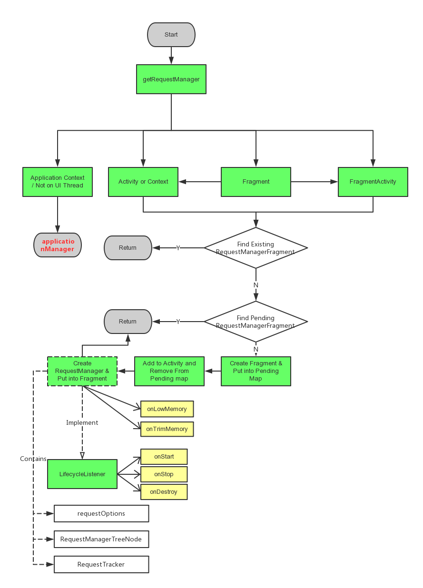

# Glide Source Code Introduction

## 1. API Introduction

*This section is written based on v3.7.0, there is a big modification on API in v4.0.0, however v4.0.0 is under developing*

##### 1. DOWNLOAD

*Small different from Picasso*

```
    Glide.with([fragment/activity/context]).load(url).into([imageView/Target]);
```

##### 2. RESOURCE LOADING

*Same as Picasso*

```
    Glide.with(context).load(R.drawable.landing_screen).into(imageView1);
    Glide.with(context).load("file:///android_asset/DvpvklR.png").into(imageView2);
    Glide.with(context).load(new File(...)).into(imageView3);
```

##### 3. PLACE HOLDERS

*Same as Picasso*

```
    Glide.with(context)
        .load(url)
        .placeholder(R.drawable.user_placeholder)
        .error(R.drawable.user_placeholder_error)
        .into(imageView);
```

##### 4. TRANSFORMATION & CUSTOM TRANSFORMATION

*Similar with Picasso*

```
    Glide  
        .with(context)
        .load(UsageExampleListViewAdapter.eatFoodyImages[0])
        .override(600, 200) // resizes the image to these dimensions (in pixel). does not respect aspect ratio
        .centerCrop() // this cropping technique scales the image so that it fills the requested bounds and then crops the extra.
        .fitCenter() 
        .into(imageViewResize);
```

```
    public class BlurTransformation extends BitmapTransformation {
    
        public BlurTransformation(Context context) {
            super( context );
        }
    
        @Override
        protected Bitmap transform(BitmapPool pool, Bitmap toTransform, int outWidth, int outHeight) {
            return null; // todo
        }
    
        @Override
        public String getId() {
            return null; // todo
        }
    }

    Glide.with(context)
        .load(url)
        .transform(new CropSquareTransformation)
        .into(imageView)
```

##### 5. ANIMATION

```
    Glide.with(context)
        .load(url)
        .crossFade()
        .dontAnimate()
        .animate( android.R.anim.slide_in_left ) // or R.anim.zoom_in
        .animate( animationObject )
        .into(imageView);

```

##### 6. THUMBNAILS

*Thumbnails are different than the placeholders from a previous post. Placeholders have to be shipped with the app as a bundled resource. Thumbnails are a dynamic placeholder, that can be loaded from the Internet as well.*

*For example, if you pass 0.1f as the parameter, Glide will display the original image reduced to 10% of the size. If the original image has 1000x1000 pixels, the thumbnail will have 100x100 pixels. Since the image will be much smaller than the ImageView, you need to make sure the ScaleType of it is set correctly.*

```
	Glide  
	    .with( context )
	    .load( UsageExampleGifAndVideos.gifUrl )
	    .thumbnail( 0.1f )
	    .into( imageView2 );
```

*Advanced Thumbnails with Complete Different Requests*

*The difference is that the first thumbnail request is completely independent of the second original request. The thumbnail can be a different resource or image URL, you can apply different transformations on it, and so on.*
 
```
    private void loadImageThumbnailRequest() {  
        // setup Glide request without the into() method
        DrawableRequestBuilder<String> thumbnailRequest = Glide
            .with( context )
            .load( eatFoodyImages[2] );
    
        // pass the request as a a parameter to the thumbnail request
        Glide
            .with( context )
            .load( UsageExampleGifAndVideos.gifUrl )
            .thumbnail( thumbnailRequest )
            .into( imageView3 );
    }
```

##### 7. GIF & VIDEO

*Display gif*
```
    Glide  
        .with( context )
        .load( gifUrl )
        .asBitmap() // call to display the first frame of the Gif 
        .into( imageViewGifAsBitmap );
```

```
    Glide  
        .with( context )
        .load( gifUrl )
        .asGif() // If the url is not gif, it will fail and show error image
        .error( R.drawable.full_cake )
        .into( imageViewGif );
```

*Display local video. This only works for local videos. Videos, which are not stored on the device (for example Internet URLs), will not work! Additionally, this will only display the first frame of that video.*

*If you want to play videos or view videos from an Internet URL, look into VideoView. http://developer.android.com/reference/android/widget/VideoView.html* 

```
    String filePath = "/storage/emulated/0/Pictures/example_video.mp4";
    
    Glide  
        .with( context )
        .load( Uri.fromFile( new File( filePath ) ) )
        .into( imageViewGifAsBitmap );
```

##### 8. CACHE

```
    Glide  
        .with( context )
        .load( eatFoodyImages[0] )
        .diskCacheStrategy( DiskCacheStrategy.NONE )
        .skipMemoryCache( true )
        .into( imageViewInternet );
```

- `DiskCacheStrategy.NONE` caches nothing, as discussed
- `DiskCacheStrategy.SOURCE` caches only the original full-resolution image. In our example above that would be the 1000x1000 pixel one
- `DiskCacheStrategy.RESULT` caches only the final image, after reducing the resolution (and possibly transformations) (default behavior)
- `DiskCacheStrategy.ALL` caches all versions of the image

##### 9. GLIDE MODULES & GLOBAL CONFIGURATIONS

*Glide modules are an abstract way of globally changing the way Glide behaves. If you need access to the GlideBuilder, which creates the Glide instance you're working with, this is the way to go. In order to customize Glide, you'll need to implement a public class against the GlideModule interface:*

*ApplyOptions*

```
    public class GlideConfigModule implements GlideModule {
    
        @Override
        public void applyOptions(Context context, GlideBuilder builder) {
            builder
                .setDiskCache(new InternalCacheDiskCacheFactory(context, "glide_cache", ConfigConstants.MAX_CACHE_DISK_SIZE))
                .setMemoryCache(new LruResourceCache(ConfigConstants.MAX_CACHE_MEMORY_SIZE))
                .setBitmapPool(new LruBitmapPool(ConfigConstants.MAX_CACHE_MEMORY_SIZE))
                .setDiskCacheService(ExecutorService service)
                .setResizeService(ExecutorService service)
                .setDecodeFormat(DecodeFormat.PREFER_ARGB_8888);
        }
    
        @Override
        public void registerComponents(Context context, Glide glide) {
        }
    }

    <manifest
    
        ...
    
        <application>
    
            <meta-data
                android:name="io.futurestud.tutorials.glide.glidemodule.GlideConfigModule"
                android:value="GlideModule" />
    
            ...
    
        </application>
    </manifest>  
```

*RegisterComponents*

*Glide also supports custom components, such as network, imageloader, etc. Detail Usages are shown in this link:*
*https://futurestud.io/tutorials/glide-module-example-accepting-self-signed-https-certificates*

## 2. Project Design & Structure

*This section is written based on v4.0 and I make same comparision between v3.7 and v 4.0*

An overall architecture of Glide：


- V：RequestManager & RequestBuilder & RequestOption
- C：Engine & EngineJob & DecodeJob
- M：Resource DataFetcher
- S：MemoryCache DiskCache

我们从glide的调用过程开始分析，4.0开始glide将所有配置相关接口从RequestBuilder中抽离，提供RequestOption类专门提供各类设置。这种重构提供了更好的扩展性，也是基于SRP原则。之后的源码分析我们主要基于4.0版本。

```
// In v4.0.0:
	Glide.with(context)
		.load(url)
		.apply(centerCropTransform(this).placeholder(R.drawable.user_placeholder))
		.thumbnail(0.1f)
		.into(ImageView)
		
// In v3.7.0:		
	Glide.with(context)
		.load(url)
		.centerCrop()
		.thumbnail(0.1f)
		.placeholder(R.drawable.user_placeholder)
		.into(ImageView)
```

### 2.1. Glide.with(...) -> 任务请求生成，图片生命周期管理

图片缓存管理与回收跟随context或fragment的生命周期是Glide的一大特色。这个功能的实现便来自于`with([fragment/activity/context])`函数。

一个基本原理是向activity注册一个fragment，通过这个fragment来接收activity的生命周期通知，并根据这些生命周期来决定是否要回收图片缓存。这个过程由`RequestManager`来管理。

首先我们看一下处理生命周期的流程图



RequestManager生成代码：

```
  @TargetApi(Build.VERSION_CODES.HONEYCOMB)
  public RequestManager get(Activity activity) {
    if (Util.isOnBackgroundThread() || Build.VERSION.SDK_INT < Build.VERSION_CODES.HONEYCOMB) {
      return get(activity.getApplicationContext());
    } else {
      assertNotDestroyed(activity);
      android.app.FragmentManager fm = activity.getFragmentManager();
      return fragmentGet(activity, fm, null);
    }
  }
```

```
  @TargetApi(Build.VERSION_CODES.HONEYCOMB)
  RequestManager fragmentGet(Context context, android.app.FragmentManager fm,
      android.app.Fragment parentHint) {
    RequestManagerFragment current = getRequestManagerFragment(fm, parentHint);
    RequestManager requestManager = current.getRequestManager();
    if (requestManager == null) {
      // TODO(b/27524013): Factor out this Glide.get() call.
      Glide glide = Glide.get(context);
      requestManager =
          new RequestManager(glide, current.getLifecycle(), current.getRequestManagerTreeNode());
      current.setRequestManager(requestManager);
    }
    return requestManager;
  }
```

```
  @TargetApi(Build.VERSION_CODES.JELLY_BEAN_MR1)
  RequestManagerFragment getRequestManagerFragment(
      final android.app.FragmentManager fm, android.app.Fragment parentHint) {
    RequestManagerFragment current = (RequestManagerFragment) fm.findFragmentByTag(FRAGMENT_TAG);
    if (current == null) {
      current = pendingRequestManagerFragments.get(fm);
      if (current == null) {
        current = new RequestManagerFragment();
        current.setParentFragmentHint(parentHint);
        pendingRequestManagerFragments.put(fm, current);
        fm.beginTransaction().add(current, FRAGMENT_TAG).commitAllowingStateLoss();
        handler.obtainMessage(ID_REMOVE_FRAGMENT_MANAGER, fm).sendToTarget();
      }
    }
    return current;
  }
```

RequestManager生命周期管理代码：

```
  /**
   * Lifecycle callback that registers for connectivity events (if the
   * android.permission.ACCESS_NETWORK_STATE permission is present) and restarts failed or paused
   * requests.
   */
  @Override
  public void onStart() {
    resumeRequests();
    targetTracker.onStart();
  }

  /**
   * Lifecycle callback that unregisters for connectivity events (if the
   * android.permission.ACCESS_NETWORK_STATE permission is present) and pauses in progress loads.
   */
  @Override
  public void onStop() {
    pauseRequests();
    targetTracker.onStop();
  }

  /**
   * Lifecycle callback that cancels all in progress requests and clears and recycles resources for
   * all completed requests.
   */
  @Override
  public void onDestroy() {
    targetTracker.onDestroy();
    for (Target<?> target : targetTracker.getAll()) {
      clear(target);
    }
    targetTracker.clear();
    requestTracker.clearRequests();
    lifecycle.removeListener(this);
    lifecycle.removeListener(connectivityMonitor);
    mainHandler.removeCallbacks(addSelfToLifecycle);
    glide.unregisterRequestManager(this);
  }
```

with()方法根据传入的context返回一个已有的或者新的RequestManager，之后通过调用load()方法获取RequestBuilder来生成一个完整的请求。

接下来我们来看一下RequestBuilder与RequestOption相关逻辑：

### 2.2. Glide.load().apply().into() -> RequestBuilder, RequestOption

#### load()

load方法用于设置图片源

```
  public RequestBuilder<TranscodeType> load(@Nullable Object model);
  public RequestBuilder<TranscodeType> load(@Nullable String string);
  public RequestBuilder<TranscodeType> load(@Nullable Uri uri);
  public RequestBuilder<TranscodeType> load(@Nullable File file);
  public RequestBuilder<TranscodeType> load(@Nullable Integer resourceId);
  public RequestBuilder<TranscodeType> load(@Nullable URL url);
  public RequestBuilder<TranscodeType> load(@Nullable byte[] model);
```

事实上在通常清空下，这些方法只有第一个方法会真正被RequestManager调用，其最终调用方法为`loadGeneric`，即将路径保存到model变量中：

```
  private RequestBuilder<TranscodeType> loadGeneric(@Nullable Object model) {
    this.model = model;
    isModelSet = true;
    return this;
  }
```

#### apply()

apply方法用于配置各种请求参数，其接受一个RequestOption类参数。

```
  public RequestBuilder<TranscodeType> apply(@NonNull BaseRequestOptions<?> requestOptions) {
    Preconditions.checkNotNull(requestOptions);
    BaseRequestOptions<?> toMutate = defaultRequestOptions == this.requestOptions
        ? this.requestOptions.clone() : this.requestOptions;
    this.requestOptions = toMutate.apply(requestOptions);
    return this;
  }
```

这个类的设计比较有意思。由于各种属性可以选择配置或不配置，并且某些属性之间存在互斥。同时apply()接口可以被多次调用，甚至异步并发调用。
RequestOption底层使用`private int fields;`以及|=操作来保存相关配置是否已被设置。例如：

```
  public final CHILD override(int width, int height) {
    if (isAutoCloneEnabled) {
      return clone().override(width, height);
    }

    this.overrideWidth = width;
    this.overrideHeight = height;
    fields |= OVERRIDE;

    return selfOrThrowIfLocked();
  }
```

此外对于某些可能存在并发问题的操作进行加锁（`autoLock()`），如果当前对象被锁住，则复制一份拷贝，在拷贝上操作并返回这份拷贝。例如：

```
  public static RequestOptions fitCenterTransform(Context context) {
    if (fitCenterOptions == null) {
      fitCenterOptions = new RequestOptions()
          .fitCenter(context.getApplicationContext())
          .autoLock();
    }
    return fitCenterOptions;
  }
```

#### thumbnail()

thumbnail用于设置预览图，这个设置接受两种参数：

```
	public RequestBuilder<TranscodeType> thumbnail(float sizeMultiplier) {
		if (sizeMultiplier < 0f || sizeMultiplier > 1f) {
			throw new IllegalArgumentException("sizeMultiplier must be between 0 and 1");
    	}
    	this.thumbSizeMultiplier = sizeMultiplier;
		return this;
	}
	
	public RequestBuilder<TranscodeType> thumbnail(@Nullable RequestBuilder<TranscodeType> thumbnailRequest) {
		this.thumbnailBuilder = thumbnailRequest;
		return this;
    }
	
```

第一种参数接受一个简单缩放比，第二种参数接受一个全新的RequestBuilder，因此thumbnail是可以嵌套的。

#### into()

into()方法根据之前的配置创建并执行最终的request，并且加载到target中。

```
  public <Y extends Target<TranscodeType>> Y into(@NonNull Y target) {
    Util.assertMainThread();
    Preconditions.checkNotNull(target);
    if (!isModelSet) {
      throw new IllegalArgumentException("You must call #load() before calling #into()");
    }

    Request previous = target.getRequest();

    if (previous != null) {
      requestManager.clear(target);
    }

    requestOptions.lock();
    Request request = buildRequest(target);
    target.setRequest(request);
    requestManager.track(target, request);

    return target;
  }
```

这个方法首先会清除同一个target中之前的request，再创建一个新的request。

buildRequest方法最终会调用如下递归函数，该函数负责根据相关配置创建一个Request对象：

```
  private Request buildRequestRecursive(Target<TranscodeType> target,
      @Nullable ThumbnailRequestCoordinator parentCoordinator,
      TransitionOptions<?, ? super TranscodeType> transitionOptions,
      Priority priority, int overrideWidth, int overrideHeight) {
    if (thumbnailBuilder != null) {
      
      // ...
      
      Request fullRequest = obtainRequest(target, requestOptions, coordinator,
          transitionOptions, priority, overrideWidth, overrideHeight);
      isThumbnailBuilt = true;
      // Recursively generate thumbnail requests.
      Request thumbRequest = thumbnailBuilder.buildRequestRecursive(target, coordinator,
          thumbTransitionOptions, thumbPriority, thumbOverrideWidth, thumbOverrideHeight);
      isThumbnailBuilt = false;
      coordinator.setRequests(fullRequest, thumbRequest);
      return coordinator;
      
    } else if (thumbSizeMultiplier != null) {
    
      // Base case: thumbnail multiplier generates a thumbnail request, but cannot recurse.
      ThumbnailRequestCoordinator coordinator = new ThumbnailRequestCoordinator(parentCoordinator);
      Request fullRequest = obtainRequest(target, requestOptions, coordinator, transitionOptions,
          priority, overrideWidth, overrideHeight);
      BaseRequestOptions<?> thumbnailOptions = requestOptions.clone()
          .sizeMultiplier(thumbSizeMultiplier);

      Request thumbnailRequest = obtainRequest(target, thumbnailOptions, coordinator,
          transitionOptions, getThumbnailPriority(priority), overrideWidth, overrideHeight);

      coordinator.setRequests(fullRequest, thumbnailRequest);
      return coordinator;
    } else {
      // Base case: no thumbnail.
      return obtainRequest(target, requestOptions, parentCoordinator, transitionOptions, priority,
          overrideWidth, overrideHeight);
    }
  }
```

requestManager.track()负责具体的请求执行：

```
  void track(Target<?> target, Request request) {
    targetTracker.track(target);
    requestTracker.runRequest(request);
  }
```

该方法首先将target放入目标追踪器(targetTracker)中，其次由请求追踪器执行(requestTracker)。targetTracker是一个简单的set缓存管理器，requestTracker则是一个任务队列管理器。最终所有的请求都会由SingleRequest具体负责执行。

SingleRequest实现了Request接口，该类提供了任务的执行，暂停，取消，target监听器的触发等功能。

```
  public void begin() {
    stateVerifier.throwIfRecycled();
    startTime = LogTime.getLogTime();
    if (model == null) {
      if (Util.isValidDimensions(overrideWidth, overrideHeight)) {
        width = overrideWidth;
        height = overrideHeight;
      }
      // Only log at more verbose log levels if the user has set a fallback drawable, because
      // fallback Drawables indicate the user expects null models occasionally.
      int logLevel = getFallbackDrawable() == null ? Log.WARN : Log.DEBUG;
      onLoadFailed(new GlideException("Received null model"), logLevel);
      return;
    }

    status = Status.WAITING_FOR_SIZE;
    if (Util.isValidDimensions(overrideWidth, overrideHeight)) {
      onSizeReady(overrideWidth, overrideHeight);
    } else {
      target.getSize(this);
    }

    if ((status == Status.RUNNING || status == Status.WAITING_FOR_SIZE)
        && canNotifyStatusChanged()) {
      target.onLoadStarted(getPlaceholderDrawable());
    }
    if (Log.isLoggable(TAG, Log.VERBOSE)) {
      logV("finished run method in " + LogTime.getElapsedMillis(startTime));
    }
  }
```

当一个任务开始时，会执行begin接口，具体请求触发在onSizeReady中（这个方法也可能在target.getSize()中被触发）：

```
public void onSizeReady(int width, int height) {
    stateVerifier.throwIfRecycled();
    if (Log.isLoggable(TAG, Log.VERBOSE)) {
      logV("Got onSizeReady in " + LogTime.getElapsedMillis(startTime));
    }
    if (status != Status.WAITING_FOR_SIZE) {
      return;
    }
    status = Status.RUNNING;

    float sizeMultiplier = requestOptions.getSizeMultiplier();
    this.width = maybeApplySizeMultiplier(width, sizeMultiplier);
    this.height = maybeApplySizeMultiplier(height, sizeMultiplier);

    if (Log.isLoggable(TAG, Log.VERBOSE)) {
      logV("finished setup for calling load in " + LogTime.getElapsedMillis(startTime));
    }
    loadStatus = engine.load(
        glideContext,
        model,
        requestOptions.getSignature(),
        this.width,
        this.height,
        requestOptions.getResourceClass(),
        transcodeClass,
        priority,
        requestOptions.getDiskCacheStrategy(),
        requestOptions.getTransformations(),
        requestOptions.isTransformationRequired(),
        requestOptions.getOptions(),
        requestOptions.isMemoryCacheable(),
        requestOptions.getUseUnlimitedSourceGeneratorsPool(),
        this);
    if (Log.isLoggable(TAG, Log.VERBOSE)) {
      logV("finished onSizeReady in " + LogTime.getElapsedMillis(startTime));
    }
  }
```

onSizeReady方法中执行engine.load()开始真正的图片加载。

**至此,Glide View层结束，即暴露给用户的接口至此完毕，下一节将从Engine开始分析Controller层**

### 2.3. Engine (EngineJob & DecodeJob)

Engine是核心图片加载与处理引擎。我们从Engine.load()方法开始分析：

```
  public <R> LoadStatus load(
      GlideContext glideContext,
      Object model,
      Key signature,
      int width,
      int height,
      Class<?> resourceClass,
      Class<R> transcodeClass,
      Priority priority,
      DiskCacheStrategy diskCacheStrategy,
      Map<Class<?>, Transformation<?>> transformations,
      boolean isTransformationRequired,
      Options options,
      boolean isMemoryCacheable,
      boolean useUnlimitedSourceExecutorPool,
      ResourceCallback cb) {
    Util.assertMainThread();
    long startTime = LogTime.getLogTime();

    EngineKey key = keyFactory.buildKey(model, signature, width, height, transformations,
        resourceClass, transcodeClass, options);

    EngineResource<?> cached = loadFromCache(key, isMemoryCacheable);
    if (cached != null) {
      cb.onResourceReady(cached, DataSource.MEMORY_CACHE);
      if (Log.isLoggable(TAG, Log.VERBOSE)) {
        logWithTimeAndKey("Loaded resource from cache", startTime, key);
      }
      return null;
    }

    EngineResource<?> active = loadFromActiveResources(key, isMemoryCacheable);
    if (active != null) {
      cb.onResourceReady(active, DataSource.MEMORY_CACHE);
      if (Log.isLoggable(TAG, Log.VERBOSE)) {
        logWithTimeAndKey("Loaded resource from active resources", startTime, key);
      }
      return null;
    }

    EngineJob<?> current = jobs.get(key);
    if (current != null) {
      current.addCallback(cb);
      if (Log.isLoggable(TAG, Log.VERBOSE)) {
        logWithTimeAndKey("Added to existing load", startTime, key);
      }
      return new LoadStatus(cb, current);
    }

    EngineJob<R> engineJob = engineJobFactory.build(key, isMemoryCacheable,
        useUnlimitedSourceExecutorPool);
    DecodeJob<R> decodeJob = decodeJobFactory.build(
        glideContext,
        model,
        key,
        signature,
        width,
        height,
        resourceClass,
        transcodeClass,
        priority,
        diskCacheStrategy,
        transformations,
        isTransformationRequired,
        options,
        engineJob);
    jobs.put(key, engineJob);
    engineJob.addCallback(cb);
    engineJob.start(decodeJob);

    if (Log.isLoggable(TAG, Log.VERBOSE)) {
      logWithTimeAndKey("Started new load", startTime, key);
    }
    return new LoadStatus(cb, engineJob);
  }
```

load主要流程如下：

生成Key(`buildKey(...)`) -> 读取内存缓存(`loadFromCache(...)`) -> 读取活跃资源缓存(`loadFromActiveResources(...)`) -> 寻找同样的正在执行的任务，如果存在注册一个callback回掉 -> 创建一个新的EngineJob和一个DecodeJob并执行。

这里ActiveResource是当前没有被释放的正在显示的图片资源（弱引用Map），Cache是LRUCache，强引用资源。

从缓存中获取的时候使用的cache.remove(key),然后将值保存在activeResources中，然后将Resource的引用计数加一。正使用的Resource将会在activeResources中，不会出现在cache中，当MemoryCache中缓存饱和的时候或者系统内存不足的时候，清理Bitmap可以直接调用recycle,不用考虑Bitmap正在使用导致异常，加快系统的回收。

#### EngineJob & GlideExecutor

EngineJob负责线程池管理，负责如下几个Executor，`diskCacheExecutor`用于本地图片读取与解析，`sourceExecutor `与`sourceUnlimitedExecutor `都用于网络图片获取，区别是前者限制最大线程数，后者不限制。

```
  private final GlideExecutor diskCacheExecutor;
  private final GlideExecutor sourceExecutor;
  private final GlideExecutor sourceUnlimitedExecutor;
```

EngineJob的start()方法中根据当前状态来选择具体的executor:

```
  public void start(DecodeJob<R> decodeJob) {
    this.decodeJob = decodeJob;
    GlideExecutor executor = decodeJob.willDecodeFromCache()
        ? diskCacheExecutor
        : getActiveSourceExecutor();
    executor.execute(decodeJob);
  }
```

EngineJob的主线程回调是一种比较经典的主线程回调设计：

```
  // 创建主线程Hanlder
  private static final Handler MAIN_THREAD_HANDLER =
      new Handler(Looper.getMainLooper(), new MainThreadCallback());
  
  // 回调对应的TYPE
  private static final int MSG_COMPLETE = 1;
  private static final int MSG_EXCEPTION = 2;
  // Used when we realize we're cancelled on a background thread in reschedule and can recycle
  // immediately rather than waiting for a result or an error.
  private static final int MSG_CANCELLED = 3;

  // 发送回调消息
  @Override
  public void onResourceReady(Resource<R> resource, DataSource dataSource) {
    this.resource = resource;
    this.dataSource = dataSource;
    MAIN_THREAD_HANDLER.obtainMessage(MSG_COMPLETE, this).sendToTarget();
  }

  @Override
  public void onLoadFailed(GlideException e) {
    this.exception = e;
    MAIN_THREAD_HANDLER.obtainMessage(MSG_EXCEPTION, this).sendToTarget();
  }

  @Override
  public void reschedule(DecodeJob<?> job) {
    if (isCancelled) {
      MAIN_THREAD_HANDLER.obtainMessage(MSG_CANCELLED, this).sendToTarget();
    } else {
      getActiveSourceExecutor().execute(job);
    }
  }

  // 处理回调消息
  private static class MainThreadCallback implements Handler.Callback {

    @Override
    public boolean handleMessage(Message message) {
      EngineJob<?> job = (EngineJob<?>) message.obj;
      switch (message.what) {
        case MSG_COMPLETE:
          job.handleResultOnMainThread();
          break;
        case MSG_EXCEPTION:
          job.handleExceptionOnMainThread();
          break;
        case MSG_CANCELLED:
          job.handleCancelledOnMainThread();
          break;
        default:
          throw new IllegalStateException("Unrecognized message: " + message.what);
      }
      return true;
    }
  }

  
  private void handleResultOnMainThread() {
    ...
  }

  private void handleCancelledOnMainThread() {
    ...
  }
  
  private void handleExceptionOnMainThread() {
    ...
  }
  
```

接下来看看Glide对线程池的封装：`GlideExecutor`

GlideExecutor继承自ThreadPoolExecutor，提供接口更简单，功能更丰富的线程池创建方法。

部分Glide暴露的接口：

```
  // 线程池创建
  public static GlideExecutor newSourceExecutor(int threadCount, String name,
      UncaughtThrowableStrategy uncaughtThrowableStrategy) {
    return new GlideExecutor(threadCount, name, uncaughtThrowableStrategy,
        false /*preventNetworkOperations*/, false /*executeSynchronously*/);
  }
  
    public static GlideExecutor newDiskCacheExecutor(int threadCount, String name,
      UncaughtThrowableStrategy uncaughtThrowableStrategy) {
    return new GlideExecutor(threadCount, name, uncaughtThrowableStrategy,
        true /*preventNetworkOperations*/, false /*executeSynchronously*/);
  }
  
  // 任务执行
  public Future<?> submit(Runnable task) {
    return maybeWait(super.submit(task));
  }

  // 最佳CPU数目计算
  public static int calculateBestThreadCount() {
    // We override the current ThreadPolicy to allow disk reads.
    // This shouldn't actually do disk-IO and accesses a device file.
    // See: https://github.com/bumptech/glide/issues/1170
    ThreadPolicy originalPolicy = StrictMode.allowThreadDiskReads();
    File[] cpus = null;
    try {
      File cpuInfo = new File(CPU_LOCATION);
      final Pattern cpuNamePattern = Pattern.compile(CPU_NAME_REGEX);
      cpus = cpuInfo.listFiles(new FilenameFilter() {
        @Override
        public boolean accept(File file, String s) {
          return cpuNamePattern.matcher(s).matches();
        }
      });
    } catch (Throwable t) {
      if (Log.isLoggable(TAG, Log.ERROR)) {
        Log.e(TAG, "Failed to calculate accurate cpu count", t);
      }
    } finally {
      StrictMode.setThreadPolicy(originalPolicy);
    }

    int cpuCount = cpus != null ? cpus.length : 0;
    int availableProcessors = Math.max(1, Runtime.getRuntime().availableProcessors());
    return Math.min(MAXIMUM_AUTOMATIC_THREAD_COUNT, Math.max(availableProcessors, cpuCount));
  }

```

线程池创建接口是对ThreadPoolExecutor的封装，提供出几种不同功能的线程池。

任务提交接口使用submit或者executor接口。submit接口提供的参数更丰富，并且支持Future返回值。

此外对于同步执行需求，GlideExecutor使用`executeSynchronously`变量进行控制，如果所创建的线程池是有同步执行需求的。对于submit接口，使用`maybewait()`等待Future的结果，对于executor接口直接执行run函数。

#### DecodeJob

DecodeJob负责图片请求，加载，解析

DecodeJob采用state模式来管理 网络下载，缓存读取，图片解析等不同的操作状态。其中不同的`Generator`负责不同的图片获取操作。

```
  private enum Stage {
    /** The initial stage. */
    INITIALIZE,
    /** Decode from a cached resource. */
    RESOURCE_CACHE,
    /** Decode from cached source data. */
    DATA_CACHE,
    /** Decode from retrieved source. */
    SOURCE,
    /** Encoding transformed resources after a successful load. */
    ENCODE,
    /** No more viable stages. */
    FINISHED,
  }

  private Stage getNextStage(Stage current) {
    switch (current) {
      case INITIALIZE:
        return diskCacheStrategy.decodeCachedResource()
            ? Stage.RESOURCE_CACHE : getNextStage(Stage.RESOURCE_CACHE);
      case RESOURCE_CACHE:
        return diskCacheStrategy.decodeCachedData()
            ? Stage.DATA_CACHE : getNextStage(Stage.DATA_CACHE);
      case DATA_CACHE:
        return Stage.SOURCE;
      case SOURCE:
      case FINISHED:
        return Stage.FINISHED;
      default:
        throw new IllegalArgumentException("Unrecognized stage: " + current);
    }
  }

  private void runWrapped() {
     switch (runReason) {
      case INITIALIZE:
        stage = getNextStage(Stage.INITIALIZE);
        currentGenerator = getNextGenerator();
        runGenerators();
        break;
      case SWITCH_TO_SOURCE_SERVICE:
        runGenerators();
        break;
      case DECODE_DATA:
        decodeFromRetrievedData();
        break;
      default:
        throw new IllegalStateException("Unrecognized run reason: " + runReason);
    }
  }
```

**Generator**

Generator目前有`ResourceCacheGenerator`, `DataCacheGenerator`, `SourceGenerator`三种。主要负责将图片加载到内存中。三个Generator的实现比较类似，这里只分析一个。

`ResourceCacheGenerator`是最先触发的一个Generator，负责从磁盘上读取Resource缓存资源。整个读取流程主要分为应用ModuleLoader和基于ModuleLoader加载数据两部分：

```
public boolean startNext() {
    List<Key> sourceIds = helper.getCacheKeys();
    if (sourceIds.isEmpty()) {
      return false;
    }
    List<Class<?>> resourceClasses = helper.getRegisteredResourceClasses();
    while (modelLoaders == null || !hasNextModelLoader()) {
      resourceClassIndex++;
      if (resourceClassIndex >= resourceClasses.size()) {
        sourceIdIndex++;
        if (sourceIdIndex >= sourceIds.size()) {
          return false;
        }
        resourceClassIndex = 0;
      }

      Key sourceId = sourceIds.get(sourceIdIndex);
      Class<?> resourceClass = resourceClasses.get(resourceClassIndex);
      Transformation<?> transformation = helper.getTransformation(resourceClass);

      currentKey = new ResourceCacheKey(sourceId, helper.getSignature(), helper.getWidth(),
          helper.getHeight(), transformation, resourceClass, helper.getOptions());
      cacheFile = helper.getDiskCache().get(currentKey);
      if (cacheFile != null) {
        this.sourceKey = sourceId;
        modelLoaders = helper.getModelLoaders(cacheFile);
        modelLoaderIndex = 0;
      }
    }

    loadData = null;
    boolean started = false;
    while (!started && hasNextModelLoader()) {
      ModelLoader<File, ?> modelLoader = modelLoaders.get(modelLoaderIndex++);
      loadData =
          modelLoader.buildLoadData(cacheFile, helper.getWidth(), helper.getHeight(),
              helper.getOptions());
      if (loadData != null && helper.hasLoadPath(loadData.fetcher.getDataClass())) {
        started = true;
        loadData.fetcher.loadData(helper.getPriority(), this);
      }
    }

    return started;
  }
```

ModuleLoader的一种可扩展的配置，在2.5节中我们将详细分析。

图片数据加载最终会调用`LoadData.fether.loadData()`方法。该方法定义来自于`DataFetcher`接口，该接口根据不同的加载类型有不同的实现，比如AssetPathFetcher, HttpUrlFetcher等等，对OKHTTP的扩展也是基于`DataFetcher`接口实现。具体的DataFetcher接口实现这里不在详细分析。

**Decoder**

图片加载到内存中后的处理是统一的，因此Glide没有像Generator一样抽出对象，而是在DecodeJob中进行。其入口是`decodeFromRetrievedData `。

```
  private void decodeFromRetrievedData() {
    if (Log.isLoggable(TAG, Log.VERBOSE)) {
      logWithTimeAndKey("Retrieved data", startFetchTime,
          "data: " + currentData
          + ", cache key: " + currentSourceKey
          + ", fetcher: " + currentFetcher);
    }
    Resource<R> resource = null;
    try {
      resource = decodeFromData(currentFetcher, currentData, currentDataSource);
    } catch (GlideException e) {
      e.setLoggingDetails(currentAttemptingKey, currentDataSource);
      exceptions.add(e);
    }
    if (resource != null) {
      notifyEncodeAndRelease(resource, currentDataSource);
    } else {
      runGenerators();
    }
  }
```

最终该接口会调用到：

```
  ...
  
  private <Data, ResourceType> Resource<R> runLoadPath(Data data, DataSource dataSource,
      LoadPath<Data, ResourceType, R> path) throws GlideException {
    DataRewinder<Data> rewinder = glideContext.getRegistry().getRewinder(data);
    try {
      return path.load(rewinder, options, width, height,
          new DecodeCallback<ResourceType>(dataSource));
    } finally {
      rewinder.cleanup();
    }
  }
  
  ...
  
    public Resource<Transcode> decode(DataRewinder<DataType> rewinder, int width, int height,
      Options options, DecodeCallback<ResourceType> callback) throws GlideException {
    Resource<ResourceType> decoded = decodeResource(rewinder, width, height, options);
    Resource<ResourceType> transformed = callback.onResourceDecoded(decoded);
    return transcoder.transcode(transformed);
  }

  ...
```

这部分逻辑没有太多分支，不再详细分析

**至此Glide加载图片的整个流程已经分析完毕，回调流程不再详述**

### 2.4. Resource & DataFetcher

### 2.5. Gif

### 2.6. GlideModule

### 2.7. Registry

## 3. Improve the performance

### A better usage

### Improve the gif performance

### Package it

