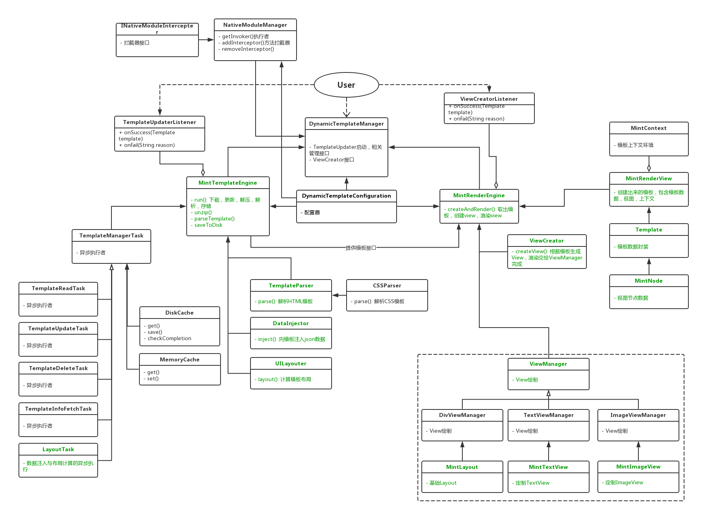

# Mint布局能力与性能架构介绍

## 需求

### 能力增强

- 支持Flex布局 + 绝对布局
- 支持响应式布局
- 增加单位：百分比和设备无关单位
- 增加若干UI组件

### 性能增强

- 降低生成View时的卡顿时间

## 技术调研

### 布局工具Yoga

- 支持Flex布局 + 绝对布局
- Native实现
- 支持异步化
- 只计算布局，需要根据布局结果进行绘制

### React Native

- 布局计算基于Yoga
- View绘制基于FrameLayout
- 异步layout + 同步绘制

### Weex

- 布局计算基于CSSLayout(Yoga前身)
- View绘制基于FramLayout
- 异步layout + 同步绘制

## 流程设计
*//流程图*


## 框架结构
*//UML类图，整体结构设计，MVP / MVC / 其它分层模式*



增加MintTemplateEngine，负责模板获取，数据注入，layout这些可以异步化的流程，重构原有TemplateManager，重构原有DataInjecter，新增UILayouter组成。

增加MintRenderEngine，负责视图创建与渲染，重构原有ViewCreator（负责视图创建），重构原有ViewManager（负责特定视图的渲染）组成。

所有视图组件重新定义，新增MintLayout（基于FrameLayout，负责视图绘制与组合），MintTextView等一系列自定义View。目的为实现布局和绘制分离，同时为后面增加JS引擎能力做铺垫。

相关Dom升级：

1. Node改为MintNode，集成YogaNode相关接口，提供视图节点相关接口，以及子布局计算接口。
2. TemplateView改为MintRenderView，提供渲染结果，上下文信息


## 接口定义
*//需要进行单元测试的、对外暴露的接口*

```
TemplateManager:
    Template getTemplate(String id, String url, TemplateUpdaterListener listener);
    void updateTemplate(String id, String url, TemplateUpdaterListener listener);
    void deleteTemplate(String id, TemplateUpdaterListener listener);
```

```
DataInjecter:
	Template inject(Template template, JsonObject jsonData);
```

```
UILayouter:
	Template layout(Template template);
```

```
ViewCreator:
	MintRenderView createView(Template template);
```

```
MintLayout:
	extends FrameLayout;
	
	void onSizeChangedListener();
	void onSizeChanged();
```

```
MintRenderEngine:
   	MintRenderView createAndRender(Template template);
```
