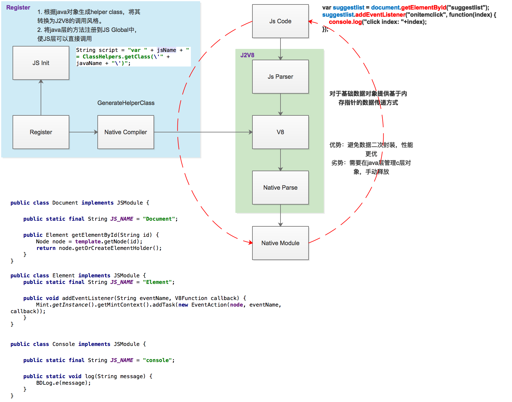

#Mint跨平台动态模板框架

## 解决的问题：

输入法想通过前端动态化技术进行一些界面的开发，但是React Native存在若干问题：包括

1. 包体积过大
2. 内存占用高
3. 必须依赖Activity
4. 当存在多个react instance的时候性能损耗严重
5. android/ios双端开发不统一

## 优势：

1. 前端容易开发：原生Html/CSS/JS，支持跨平台，前端MVVM，数据绑定，组件化
2. 渲染性能优于ReactNative，包体积、内存、渲染速度均超过React Native
3. 支持多instance，通过JS Runtime内部隔离，避免性能问题

## 技术框架

### 1. 总体框架

Mint包括 Front End、JS Bridge、Native Runtime三部分。其中Front End提供了前端开发框架，处理Java层数据、接口的封装与解析。JS Bridge负责JS与Native的通信。Native Runtime负责模板解析、编译、渲染、以及Native端能力的提供。总体架构图如下所示：


对于一个前端模板的处理，Mint会将Html文件转换成Dom Tree结构，最终渲染成真正的View Tree。


### 2. JS Bridge通信技术方案

Mint基于V8引擎与J2V8封装提供了JS层与Native层的无缝调用技术，实现了在JS层可以任意访问Native的对象与接口。其技术框架如下：



### 3. 前端数据绑定方案

Mint采用类似于Angular的数据绑定方案，使用`{{}}`标签实现数据绑定，但是对于标签的解析放于Native端处理，实现更优的性能。


### 4. 线程模型

Mint使用三线程模型，包括JS线程、Process线程、UI线程


### 5. Render技术方案

Mint采用异步布局+同步渲染的方案，其流程图如下：


### 6. UI Component组件技术方案

Mint支持自定义UI组件扩展，UI组件设计方案如下：


## 工作计划（无视）
Q1：**（完成）**

1. 设计更具扩展性的框架
2. 增强布局能力，引入Yoga布局库，统一双平台渲染效果
3. 提升模板加载与渲染速度，布局异步化，降低卡顿

Q2：

4. 引入JS引擎**（完成）**
5. JS Engine支持JS层调用与创建Native object，Native层调用js对象 [3天]
6. 流程与Task重构，增加Compiler层，重构后分为四层：Parser/Compiler/Layouter/Renderer。（框架搭建）[4天]
7. JS事件定义与响应 接口定义&实现（提供上下文查询）[3天]
8. LifeCircle 定义&实现（提供生命周期）[3天]
9. DocumentModule 接口定义&实现（提供DomTree创建与渲染接口）[5天]
10. ComponentManager 接口定义&实现（提供模板嵌套与组件化能力，Html->Node）[6天]
11. RouterModule 接口定义&实现（提供路由能力）[3天]
12. Component规范定义-ListView设计与实现 [10天]
13. 模板指令编译 [4天]

-----------以上框架总体完成-----------------------

14. 增加本地事件模块（网络，I/O，DB，动画，etc.）[10天]
15. 增加若干组件支持（button, edittext, etc.）[5天]

-----------以上可以满足7.5搜索模块动态化-----------

Q3：

16. JS-Native MVVM架构
17. Duktape与V8引擎的动态切换
18. ConstraintLayout引入
19. 异步化渲染
20. 模板开发IDE
21. 注释与文档完善
22. 单元测试完善

-----------以上可以达到开源要求-----------

## 详设

### 流程

**创建流程**

- Parser [解析HTML/CSS] -> Compiler [支持IF的Compile] -> Layouter -> Renderer

**更新流程**

- 如果只更新样式: Node.setXXX() -> View.setXXX();
- 如果更新影响布局的属性: Node.setXX() -> YogaNode.setXX() -> reLayout -> reRender;
- 如果添加节点（通过JS调用Document.addNode方式添加）: Document.addNode() -> reLayout -> reRender; 
- 如果删除节点: Document.removeNode() -> reLayout -> reRender; 

**Router流程**

1. 对于Router目标页面，走一次创建流程（需要父容器的width/height,node对象）
2. 调用ParentNode.append(CreatedNode)添加 -> 其中调用ParentView.add(CreatedView)，**不需要**reLayout与reRender


### JS事件定义与响应

**Context传入**

```
nativeOnClick(View view, Script script) {
	Node rootNode = getRootNode(view);
	setNodeToJS(rootNode); // Native层往JS层塞入Native对象
	callJS(script);
}

script {
	Node node = Document.getElementById(rootNode, id);
	node.setXXX();
	node.setYYY();
	// If any layout attributes is changed
	node.requestLayout();
}
```

**事件定义**

- onClick
- onLongClick


### JS Engine支持JS层调用与创建Native object，Native层调用js对象
目前的JS Engine Framework不支持，需要实现JNI与Java接口

### LifeCircle 定义&实现（提供生命周期）[3天]

DomLifeCycle

- onCreate - Parse之前，代表开始干活了
- onDomUpdate - Compile之后DomTree构造完成，Layout之前
- onDestroy - Dom删除之前

ViewLifeCycle

- onAppear - View创建完毕，append到UI前
- onViewUpdate - View更新完毕，append到UI前
- onDisappear - View从UI上被移出之前

## Component & Module 格式规范

### 基础模块：Document

**模块名：document**

**document.getElementById(id)**
说明：获取当前文档中指定 id 的元素
返回值：element

**document.getElementsByTagName(tagName)** [android不支持]
说明：获取当前文档中指定 tag 的元素
返回值：array[elements]

**document.getElementsByClassName(className)** [android不支持]
说明：获取当前文档中指定 class 的元素
返回值：array[elements]

**document.createElement(tagName)**
说明：在当前文档中创建指定 tag 的元素

**document.addEventListener(eventName, callback)**
说明：为当前文档添加事件
参数：eventName: DOMContentLoaded 
		   callback: 回调函数，带有触发当前事件的文档对象

```
document.addEventListener("DOMContentLoaded", function(document) { 
    console.log(document);})
```


### 基础模块：Element

**模块名：element**

**element.appendChild(child)**
说明：为元素添加一个子节点

**element.removeChild(child)**
说明：删除元素的某个子节点

**element.chideNodes** [android不支持]
说明：获取元素的所有子节点
返回值：array[elements]

**element.setAttribute(attributeName, attributeValue)**
说明：key - value 形式设置元素属性
```
element.setAttribute("style", "background-color: red");
```

**element.setAttributes(attributeDictionary)**
说明：字典形式设置元素属性，用于同时设置多个属性
```
element.setAttributes({"class" : "suggest_image", "src" : "./image.png"});
```

**element.attribute("font-size")** [android不支持]
说明：获取元素的属性值

**element.tagName**
说明：获取元素的标签名

**element.attributeID**
说明：获取元素的标签类名

**element.setStyle(styleName, styleValue)**
说明：key - value 形式设置元素样式
```
element.setStyle("background-color", "red");
```

**element.setStyles(styleDictionary)**
说明：dictionary 形式设置元素样式
```
element.setStyles({"background-color", "red", "font-size", "14px"});
```

**element.setText(text)**
说明：设置元素文本，仅对 ```<text>``` 标签的元素生效

**element.text**
说明：获取 ```<text>``` 标签元素的文本

**element.addEventListener(eventName, callback)**
说明：为元素添加事件
参数：eventName: click / swipe / longpress
		   callback: 回调函数，带有触发当前事件的元素对象
```
element.addEventListener("click", function(element) { 
    console.log(element);})
```


### 组件：List

**组件名：`<list>`**

#### List 结构

list 由 header / footer / cell 三部分组成，如下格式定义 List 并指定数据

```
<list>
	<header>
		<text>{{header}}</text>
	</header>
	<cell id="cell1">
		<text>{{cell}}</text>
	</cell>
	<cell id="cell2">
		<text>{{cell}}</text>
		<image>{{cell_image}}</image>
	</cell>
	<footer>
		<text>{{footer}}</text>
	</footer>
</list>

jsonData = {
	"header": {"header":"value1"},
	"footer": {"footer":"value2"},
	"cell": [
		{"id":"cell1","cell":"value1"},
		{"id":"cell2","cell":"value2", "cell_image":"./image.png"}
	]
}
```

**List 元素声明**

**静态 List 元素**

```
<cell id="cell1">
    <text>{{cell}}</text>
</cell>

data = {
	"cell": [
		{"id":"cell1","cell":"value1"}
	]
}
```

**Inline List 元素**

```
<cell src="source.html"></cell>

data = {
	"cell": [
		{"id":"source.html","datasource":{jsondata}}
	]
}
```

**List 嵌套**

```
<list>
	<cell id="cell1">
		<list>
			<cell src="source.html"></cell>
		</list>
	</cell>
</list>
```

#### 关联模块 ListElement

**list.setDataSource(jsonData)**

**list.addHeader(path, headJsonData);**

**list.addFooter(path, headJsonData);**

**list.addListEventListener(String event, callback);**


### Component - EditText

### Component - Button

### Module接口规范

### Module - HTTP

**模块名：http**

**http.send(request, callback)**
说明：发送请求
request 参数：
```
{
	"url" : "http://baidu.com",
	"method" : "POST", // 可省略
	"headers" : {}, // 可省略
	"body" : "" // 可省略
}
```
callback 回传参数：
```
{
	"status" : 200,
	"ok" : true,
	"text" : "hello world"
}
```


### Module - File

**模块名：fs**

**fs.directory(searchType, callback)**
说明：返回 searchType 对应的目录
searchType: 目标目录，目前 iOS 支持 "document"
回传参数：目录路径

**fs.exists(path, callback)**
说明：文件或目录是否存在
path：路径
回传参数：true or false

**fs.writeString(path, string, callback)**
说明：写文件
path：路径
string：待写入字符串
回传参数：true or false

**fs.readString(path, callback)**
说明：读文件
path：路径
回传参数：string

**fs.delete(path, callback)**
说明：删除文件
path：路径
回传参数：true or false

以上接口均有同步方法，如 fs.existsSync(path).

### Module - Storage
**模块名：storage**

**storage.setItem(item, key)**

**storage.getItem(key)**

**storage.removeItem(key)**

**storage.clear()**
说明：清空 storage


### Module - Database

### Module - Animation


