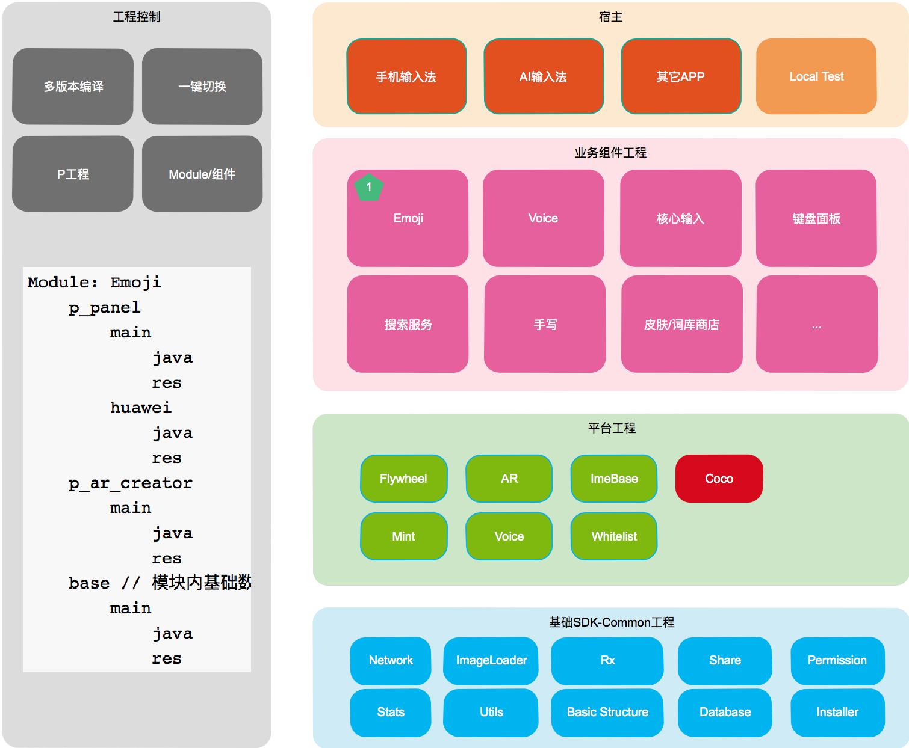

# 输入法多工程平台化管理

## 0. 目录

[TOC]

## 1. 概述

*注：本文档将会详细描述未来平台化开发中的所有技术规范与流程控制方案。*

输入法多工程方案基于[组件框架Coco](http://agroup.baidu.com/baiduinput/md/article/867880)搭建。输入法工程将会拆分成若干子工程，以便进行更细致的权限控制、更强的边界隔离，同时也可以加快编译速度，方便模块自测。

平台化整体方案如下图所示，根据模块功能属性将会被拆分成三类组件：

- 业务组件：业务强相关，并且包含所有UI的组件，比如表情、面板、手写
- 平台组件：可以提供独立业务功能的组件，如AR-SDK，语音-SDK，手写渲染-SDK，数据收集组件，Flywheel
- 基础组件：基础库组件，如网络，存储，工具类，数据库等

## 2. 组件拆分规范

### 2.1. 总体方案

组件总体拆分原则是：功能独立，边界清晰，与外界耦合尽可能少。

Coco组件接口设计原则（更详细的设计将在Coco中介绍）：

1. 组件接口以及需要对外提供的数据类以`.bpi`后缀文件命名
2. 组件对外接口应尽量少，并且优先以配置方式设计
3. 组件对外提供事件监听时，基于Coco的P/S架构实现。
4. 组件对外暴露数据类时，要求该数据类是`immutable`的，即外部只能访问，不能修改

### 2.2. 基础组件

*注：基础组件直接提供依赖包，不通过Coco进行接口解耦*

所有应用开发**必须的**基础通用功能模块统一放在`ime-common`组件中。

基础组件中添加功能的原则是：

1. 该功能是通用的，不仅适用于输入法，也可以适用于其它APP
2. 该功能是稳定的，bug量需要控制在极低的量级
3. 该功能没有性能问题，不会大量增加包体积
4. 该功能需要完善的单元测试，行覆盖90%以上
5. 对于第三方开源项目，需要考虑是否可以使用中间层隔离，如果遇到严重可以是否存在低成本替代方案

目前已有功能模块如下：

目前确定需要增加的模块如下：

未来可以考虑添加的模块如下：

### 2.3. 平台组件

*注：平台组件直接提供依赖包，不通过Coco进行接口解耦*

平台组件适用于可以提供独立业务功能的组件，每个组件都是独立的工程，并且互相之间不存在耦合。

拆分平台组件的原则是：

1. 该组件功能自洽，不依赖业务需求，即业务需求改动一般不需要改动平台组件
2. 该组件功能具有通用性，即不和输入法业务绑定，也可适用于其它业务。
3. 该组件功能独立，不和其它组件存在耦合

目前已确定拆分组件如下：

1. Flywheel性能监控
2. Mint跨平台
3. Voice-SDK
4. AR-SDK
5. WhiteList白名单
6. SkinRender皮肤渲染
7. HandWriter手写渲染
8. ACS屏幕取词
9. ImeStats数据收集

特殊平台组件如下：

1. ImeBase：该组件提供输入法基础开发框架

### 2.4. 业务组件

业务组件是包含完整UI、逻辑、数据的组件，可以独立运行在我们的输入法，或者其它APP中。外部通过其对外提供的配置接口即可简单接入该组件并进行使用。

拆分业务组件的原则是：

1. 包含完整UI、逻辑、数据
2. 可以独立运行
3. 当需要依赖外部功能时，需要通过接口配置进行依赖，而不是直接内部调用
4. 一般向外提供View、Activity、Service等集成对象

目前已确定进行拆分组件如下：

1. Emoji，包括AR表情
2. Voice，包括语音所有功能

待确定拆分组件如下：

1. Input
2. Search
3. App化
4. 键盘面板
5. 手写

业务组件拆分后需要依赖`ime-base`组件，并在其上进行开发，该组件提供了基础的输入法环境，以及相关的架构、功能。

## 3. 组件版本控制与发布

### 3.1. 总体方案

所有组件版本发布分为Release版和Snapshot版，其中Release版为稳定版需要保证功能基本不存在bug，业务APP发布Release版本时必须使用Release版本组件。Snapshot版为开发版，业务APP在测试、QQ内测、Beta时**可以**使用开发版。

组件发布时需要提供完整change-list，使用方根据change-list来决定是否需要升级该组件，并且在升级过程中需要注意什么。包括：

- 新feature
- 对外接口改动
- 接口内部逻辑改动
- bug修复内容

组件发布使用Maven仓库进行发布，基础组件与一部分平台组件发布到jcenter，剩余组件发布到私有仓库。Maven仓库发布与使用详细教程见[Maven发布](http://agroup.baidu.com/baiduinput/md/article/387921)

### 3.2. 基础组件

基础组件使用3位独立版本号，如`1.0.0`：

- 第一位版本号表示新增大量feature、接口存在大幅改动、或者整体架构存在大量改动
- 第二位版本号表示新的release版本发布
- 第三位版本号为内部迭代版本号

基础组件对外提供服务时需要先行完成开发测试。发布不跟随业务。

### 3.3. 平台组件

平台组件使用3位独立版本号，如`1.0.0`：

- 第一位版本号表示新增大量feature、接口存在大幅改动、或者整体架构存在大量改动
- 第二位版本号表示新的release版本发布
- 第三位版本号为内部迭代版本号

平台组件发布视情况决定是否需要跟随业务。

### 3.4. 业务组件

业务组件使用4位独立版本号，如`1.0.0.0`：

- 第一位版本号表示新增大量feature、接口存在大幅改动、或者整体架构存在大量改动
- 第二位版本号表示新的release版本发布
- 第三位版本号表示该版本Flavor，即是提供给主线的还是OEM的
- 第四位版本号为内部迭代版本号

业务组件发布周期跟随业务周期。

## 4. 组件分支与Flavor控制

### 4.1. 总体方案

名词解释：

- 分支：Git分支
- Flavor：Android Gradle Flavor

### 4.2. 基础组件

基础组件分支使用master、release分支控制，**不存在Flavor控制**。

开发时在master上开发，测试稳定后在releae分支上进行发布。

如遇到重大重构，或者新的大型功能，并且希望进行小规模灰度测试时，需要分叉出对应功能名分支。

*E.g. 我们需要将Glide切换成Fresco或者我们自己开发的图片加载模块时，此时不能在master进行切换，还需要建立新分支`dev_new_imageloader`，进行开发测试，并发布snapshot版本。*

### 4.3. 平台组件

平台组件分支使用master、dev、release分支控制，**不存在Flavor控制**。

开发时在dev上开发，测试稳定后在releae分支上进行发布，合入master。

如存在功能分支情况，对于不同业务平台不同的需求应**尽可能保证通过接口配置方式进行兼容，而不是发布出不同版本**，只有在必须情况下分叉出对应功能名分支。如`dev`，`dev_for_huawei`。

*E.g.1. 对于AR表情，华为要求美颜偏瘦，主线要求正常状态，此时对于平台组件需要对外提供配置接口，而不是分叉出华为分支。*

*E.g.2. 对于Mint，主线使用不带JS Engine版本，AI输入法希望使用带JS Engine版本，此时单纯配置无法满足，可以建立新分支`dev_with_jsengine`。*

### 4.4. 业务组件

业务组件分支使用master、dev_版本号分支控制，通过Flavor控制主线或OEM版本。

通常来说，逻辑与数据层面应尽可能避免Flavor控制，这部分应通过接口配置方式兼容不同功能，Flavor只在View层面进行不同需求的区分。即**需求差异性首先通过代码扩展性来补足，其次通过Flavor区分**

对于主线版本开发，仍然需要新建分支`dev_x_x_0_0`，并且在该分支上进行开发。

对于OEM版本开发，**也需要建立新分支**`dev_x_x_y_0`，该分支必须基于稳定主线分支拉出，并且在开发发布完成后，尽可能合入下一个主线`dev_x_(x+1)_0_0`。即我们认为OEM版本是一个主线的**中间态小版本**，而**非分叉版本**。

如果一个OEM版本是基于一个旧的主线版本拉出，则其上功能可视情况合入最新主线版本，但是在条件允许的情况下，合入是更好的选择。

版本发布时，根据情况发布对应Flavor的aar即可。

## 5. APP集成规范

// TODO 确认组件集成规范

## 6. 测试流程

### 6.1. 基础组件

基础组件测试完全基于单元测试与RD自测。

### 6.2. 平台组件

平台组件测试视情况QA介入测试。

### 6.3. 业务组件

业务组件测试需要QA在TestApp下进行功能性测试。

## 7. 组件拆分示例

### 7.1. Ime-Stats

### 7.2. Ime-Emoji
 