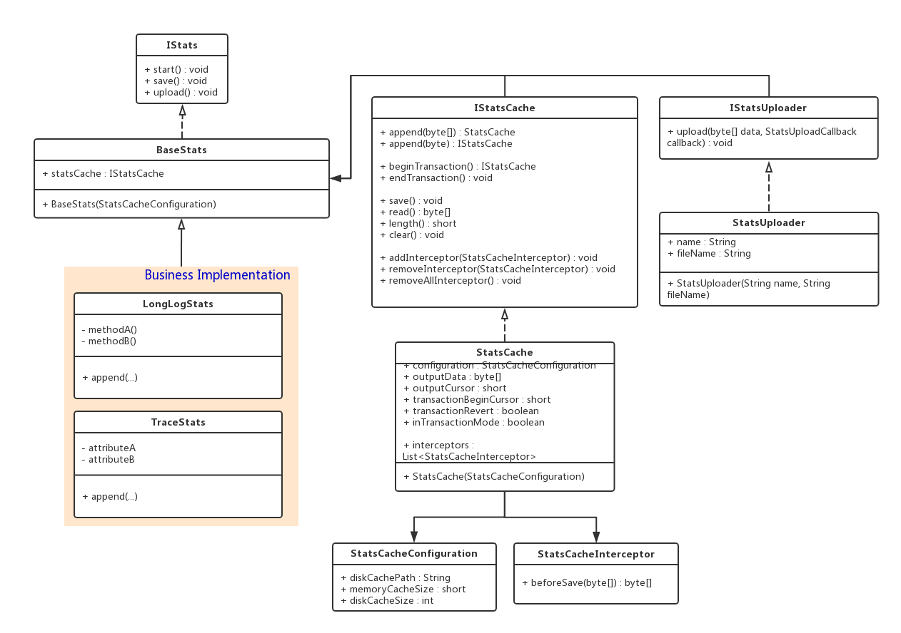

# Stats 数据收集模块设计

## 需求分析

目前输入法已有数据收集类型：

1. **长log：** 结构化的字节数组数据
2. **轨迹：** 结构化的字节数组数据
3. **8400设置项：** key-value型，但是以字节数组数据
4. **8409Count型流水：** key-value（int）型数据
5. **8410结构型流水：** key-value（jsonobject）型数据
6. **8401-8408旧类型数据统计：** key-value型，但目前以字节数组存储。

*现状：每个模块各自为政*

*目标：抽离并整合缓存/存储/上传模块，提供统一对外接口*

## 框架结构

### common/
负责通用数据收集模块与底层实现

**框架图**



输入法业务使用的各种数据收集类主要分为：

1. LongLogStats
2. TraceStats
3. WaterflowStats
4. SettingsStats
5. ...

其中每一个XXXStats类都继承自BaseStats，通过统一安装调用服务Stats进行安装与调用:

```
<T extends IStats> void install(Class<T> className)
<T extends IStats> T use(Class<T> className)
```

**StatsCache设计**

核心：byte[]数组操作，事务支持

```

    @Override
    public IStatsCache append(byte[] data) {
        boolean isOverLimit = isOverLimit(data.length);
        if (!inTransactionMode) {
            if (!isOverLimit) {
                appendRaw(data);
            }
        } else {
            if (!transactionRevert && !isOverLimit) {
                appendRaw(data);
            } else {
                transactionRevert = true;
            }
        }
        return this;
    }

    @Override
    public IStatsCache append(byte data) {
        byte[] dataArray = new byte[1];
        dataArray[0] = data;
        return append(dataArray);

        // TODO or use below to improve performance ?
//        boolean isOverLimit = isOverLimit(1);
//        if (!inTransactionMode) {
//            if (!isOverLimit) {
//                appendRaw(data);
//            }
//        } else {
//            if (!transactionRevert && !isOverLimit) {
//                appendRaw(data);
//            } else {
//                transactionRevert = true;
//            }
//        }
//        return this;
    }

    private boolean isOverLimit(int appendLength) {
        return outputCursor + appendLength > configuration.memoryCacheSize;
    }

    private void appendRaw(byte data) {
        outputData[outputCursor] = data;
        outputCursor++;
    }

    private void appendRaw(byte[] data) {
        System.arraycopy(data, 0, outputData, outputCursor, data.length);
        outputCursor += data.length;
    }

    @Override
    public IStatsCache beginTransaction() {
        if (inTransactionMode) {
            throw new IllegalStateException("Already in transaction mode. You should call endTransaction " +
                    "to stop previous transaction");
        }
        transactionBeginCursor = outputCursor;
        transactionRevert = false;
        inTransactionMode = true;
        return this;
    }

    @Override
    public void endTransaction() {
        if (!inTransactionMode) {
            throw new IllegalStateException("Not in transaction mode. You should call beginTransaction first");
        }
        if (transactionRevert) {
            outputCursor = transactionBeginCursor;
        }
        transactionRevert = false;
        inTransactionMode = false;
    }

```


### inputmethod/
输入法相关数据收集模块封装

由于不同数据收集类的接口千差万别，因此具体的添加数据的接口不在IStats中，而是下放到具体类中：

**LongLogStats**

接口addData，可以根据不同的key值决定添加数据的格式。目前有3类

```
    public static final byte KEY_TEXT = 1; // 普通数据
    public static final byte KEY_DELETE_INFO = 2; // 删除键数据
    public static final byte KEY_SPECIAL_CHAR = 3; // 特殊字符数据
    
    /**
     * 记录数据
     *
     * @param key    数据类型 KEY_TEXT等
     * @param value  数据值
     * @param extend 额外数据，长log记录数据来源
     */
    public void addData(int key, String value, Object... extend) {
        if (!Global.log.getFlag(Option.CCFLAG_SUBMIT_CLC)) {
            return;
        }
        if (TextUtils.isEmpty(value)) {
            return;
        }
        byte[] data = null;
        switch (key) {
            case KEY_TEXT:
                data = getText(value);
                break;
            case KEY_DELETE_INFO:
                data = getDeleteInfo(value);
                break;
            case KEY_SPECIAL_CHAR:
                data = getSpecialChar(value);
                break;
            default:
                break;
        }
        if (data != null) {
            synchronized (statsCache) {
                statsCache.beginTransaction();
                addStartInfo(extend);
                statsCache.append(data);
                statsCache.endTransaction();
            }
        }
    }

```

**TraceStats**

接口如下，前两位为apart和action，后面的参数根据具体记录数据的需求决定

```
    public void addData(byte apart, byte action, byte[] value);
    public void addData(byte apart, byte action, String value);
    public void addData(byte apart, byte action, byte value);
    public void addData(byte apart, byte action, long value);
    public void addData(byte apart, byte action, short value);
    public void addData(byte apart, byte action, short[] value);
    public void addData(byte apart, byte action, short[] value,
                        byte pressure, byte fatTouchSize);
    public void addData(byte apart, byte action, String value,
                        byte spFlag, short xValue, short yValue,
                        byte pressure, byte fatTouchSize);
```


