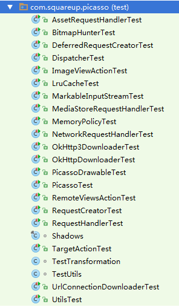
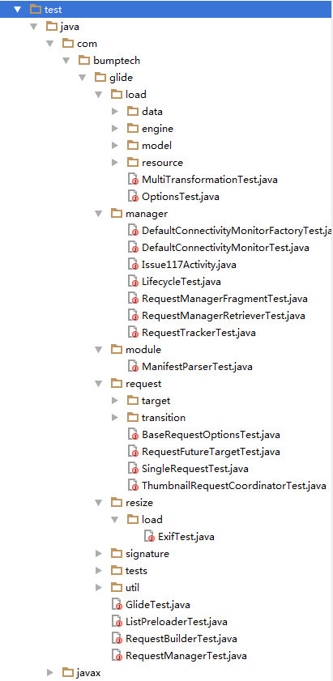
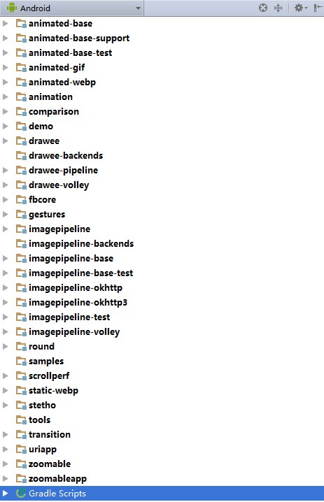
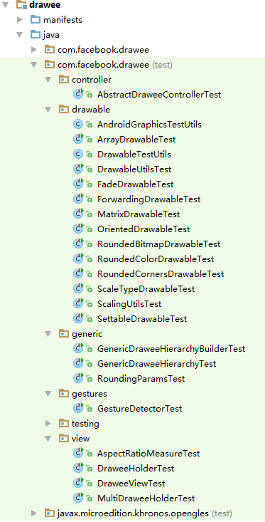
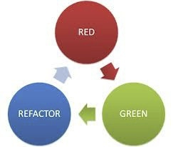

# TDD、自动化测试、单元测试：这坑能进吗？

## 1. 什么是TDD？

## 2. 为什么要TDD？

## 3. 为什么国内TDD推动不起来？

## 4. 有没有适合国内的方案

## 1. 为什么要单元测试？

1. 做了一个很大的底层改动，跑一遍单元测试，哇，全通过了！有信心将代码发布出去了；
2. 在开发之前写测试代码让开发者仔细想清楚需求，并对自己的代码进行思考，每一个操作应用后将会产生什么样的期望后果，这种情况下编写代码的bug数量也会更少；
3. 先写测试可以强制我们的功能模块遵循DIP原则（依赖倒置），使得模块间更解耦，抽象接口不依赖于细节实现。
5. **Android下很多非UI模块难以测试，等完成UI后统一测试时很容易忽略某些潜藏的子模块bug**

 
## 2. 开发流程

1. 拆分模块功能：对一个大模块拆分成若干子模块，保证模块间的依赖关系是层次的。
2. 添加测试用例：对每个子模块，先设计出接口行为，添加空的实现，然后将测试用例快速写出来。
3. 实现细节代码：针对我们写下的测试用例，完善代码。注意，在此阶段，你的所有目标就是让代码通过步骤(1)加入的测试用例。你不应该添加跟步骤(1)所加入的测试中无关的代码。
4. 优化代码：由于3中的目标是通过测试，因此可能存在不太妥当的代码风格与结构，优化代码来保证整体结构清晰。


## 3. 单元测试简介

### 单元测试定义
单元测试是指对软件中的最小可测试单元进行检查和验证，它满足：

- 一致性 重复运行相同单元测试的结果一致。
- 隔离性 单元测试只在一个小模块内进行，不与其他模块交互，也不影响其他单元测试。

### F.I.R.S.T.准则

**快速（Fast）** 
测试应该足够快，可以频繁运行。运行缓慢，就不会频繁去测试，不能尽早发现问题。最终代码就会腐坏。

**独立（Independent）** 测试间相互独立，某一个测试不该成为下一个测试的前提条件。测试相互依赖时，第一个没通过会导致一连串的失败。

**可重复（Repeatable）**
测试应当在任何环境中重复通过。无论是生产环境还是发布环境。如果不能在任意环境下重复，总会有个解释其失败的借口

**自足验证（Self-Validating）**
测试应该有bool值输出。不应该通过日志文件来确认其是否通过。

**及时（Timely）**
测试应该及时编写。单元测试应该在生产代码之前编写。如果在生产代码完成之后编写测试，会发现生产代码难以测试。


### Jnit
JUnit是一个Java的Unit测试库。它提供了一套比较成熟的单元测试解决方案，每个测试类里面有多个测试用例，并提供了用例前后的Hook、Rule等方便测试。由于目前Android支持Junit4，因此本文中只基于Junit4进行介绍。
如下是Junit4的代码示例：
``` java
public class JUnit4Test {    //在每个测试方法执行前建立临时文件，结束后删除它。
    @Rule
    public TemporaryFolder mFolder
        = new TemporaryFolder();  

     //同JUnit3中setup
    @Before
    public void before() {}    //同JUnit3中的teardown
    
    @After
    public void after() {}    //在该类第一个测试方法执行前被调用，只会调用一次。
    
    @BeforeClass
    public static void beforeClass() {
        PowerMockito.mockStatic(ForMock.class);
    }    //在该类第一个测试方法执行后被调用，只会调用一次。
    
    @AfterClass
    public static void afterClass() {
    }    //所有测试类使用@Test注解
    
    
    @Test(expected = NullPointerException.class, timeout = 200)    
    public void testExceptionAndTimeout() {
        doSomething();
    }    
    
    private void doSomething() throws NullPointerException {        
        throw new NullPointerException();
    }
}
```

### Mock
Mock是测试中非常经常使用到的一个术语，它的作用就如字面意思：“虚拟对象”。它有很多方面的作用，特别是在测试上。我们之前所说，测试就是需要列举出“触发动作”和验证”期望结果”。那么现在有两个问题：
1. 通常我们在设计代码的时候，不会去保留操作结果，这会给程序带来非常多冗余的变量、代码逻辑。
2. 触发动作经常是有一定上下文、环境依赖的，测试中难以模拟出这个情况。

Mockito(http://mockito.org) 是一个开源的Mock库。提供了创建虚拟类(Mock)、局部扩展(Spy)、验证调用行为(Verify)的API。
PowerMock(https://github.com/jayway/powermock) 是针对上述Mockito的拓展。它通过自定义的ClassLoader，能够达到它们无法做到的一些事情：针对静态类、final类、private方法的Mock与Verify。

这里需要注意，
**使用Mock之前应该仔细思考它的必要性，如果你花很多时间、大量代码来生成Mock、验证Mock对象的行为，这可能就偏离了测试的初衷，走入了“为测试而测试”的陷阱。**
你可能就要思考，为什么你的代码需要这么多Mock才能够被单元测试，会不会写的耦合度太高了？

``` java
@RunWith(PowerMockRunner.class)
@PrepareForTest({System.class})
public class TimeUtilsTest {  
    @Before
    public void setUp() {
        Random random = new Random(RANDOM_SEED);

        PowerMockito.mockStatic(System.class);                   //直接将System.currentTimeMillis设置为0.
        when(System.currentTimeMillis()).thenReturn(0l);
    }
}
```

### 断言
Assert，是单元测试中非常重要的环节之一。它是用于校验输出结果与期望结果的语法。

Junit下的Assert语法如下

``` java
Assert.assertEquals(expected, actual);
Assert.assertNotEquals(expected, actual);
Assert.assertSame(expected, actual);
Assert.assertNotSame(expected, actual);
Assert.assertArrayEquals(expectedArray, actualArray);
```

由于JUnit原生的Assert还是不够强大，只能判断等于、不等于的情况，它实际上只提供了很基础的相同值/实例的判断，这样代码可读性、易用性就会收到影响。所以各类开源库出现，对它进行了封装：

1. Hamcrest(http://hamcrest.org/JavaHamcrest/) 是一个开源的Assert语法拓展库，它提供了方便、强大的情景匹配API，不仅支持Java，也支持其他多种语言。
2. AssertJ(http://joel-costigliola.github.io/assertj/) 是另一个开源的Assert语法的拓展库，它提供了各类方便的情景检查与链式调用的语法糖，易于拓展，用起来非常舒服。
3. AssertJ-Android(https://github.com/square/assertj-android) 是Square针对AssertJ的一个拓展，提供了对Android各类控件的情景检查。

Hamcret

``` java
import static org.hamcrest.Matchers.*;
@Test
public void testHamcrest() {
    List<String> strings = new ArrayList<>();
    strings.add("test");
    MatcherAssert.assertThat(strings, not(empty()));
    MatcherAssert.assertThat(strings, contains("test"));
    MatcherAssert.assertThat(strings, hasSize(1));
    MatcherAssert.assertThat(strings, is(instanceOf(ArrayList.class)));
}
```

AssertJ

``` java
@Test
public void testAssertJ() {
    List<String> strings = new ArrayList<>();
    strings.add("test");
    Assertions.assertThat(strings)
        .isInstanceOf(ArrayList.class)
        .isNotEmpty()
        .contains("test", Index.atIndex(0))
        .hasSize(1);
}
```

### 覆盖率
覆盖率(Coverage)即跑一遍单元测试，统计覆盖到的各类代码的指标。简单来说有这么几种：
1. 函数覆盖率 一个类里面被单元测试调用到的函数在它所有函数中的占比。
2. 语句覆盖率、分支覆盖率 一个类中，单元测试所覆盖的语句、分支在这个类的语句、分支中的占比。

覆盖率其实有的时候不能说明什么，测试覆盖率高的代码不一定就是很稳定的代码。写了很多测试，调用了很多工程代码，最后可能然并卵。但是有一点是认可的，未覆盖率 能帮助你对代码的回归思考：

```
如果你写测试都不测这个函数，那它会不会有问题？那它是不是真的会用到？
```

## 4. Android相关测试工具

### 本地测试 vs Instrument 测试

本地测试：跑在JVM上的单元测试，在/src/test/java下的代码。配合Robolectric也可以跑部分Android相关的代码测试。容易书写，容易运行。

Instrument 测试：跑在Android设备上的测试，在/src/androidTest/java下的代码。通常使用到的工具包括Espresso, UIAutomator, AndroidJunitRunner。Instrument测试运行在与目标App同一个进程中。能够提供各类Android设备、运行时、多应用交互相关的API，这是Local Unit测试无法比拟和提供的。


### Roboletric （jvm环境下的android.jar + shadow）

roboletric的出现让一些仅跟UI交互的Android代码变得非常容易测试，它能够让一些仅依赖UI、对于Android设备环境没有强需求的模块（GPS、电池状态、跨App请求等）能够直接在JVM上跑起部分Android相关的测试代码。

Roboletric通过实现一套JVM能运行的Android代码，然后在unit test运行的时候去截取android相关的代码调用，然后转到他们的他们实现的代码去执行这个调用的过程。举个例子说明一下，比如android里面有个类叫TextView，他们实现了一个类叫ShadowTextView。这个类基本上实现了TextView的所有公共接口，假设你在unit test里面写到 
String text = textView.getText().toString();。在这个unit test运行的时候，Robolectric会自动判断你调用了Android相关的代码textView.getText()，然后这个调用过程在底层截取了，转到ShadowTextView的getText实现。而ShadowTextView是真正实现了getText这个方法的，所以这个过程便可以正常执行。

除了实现Android里面的类的现有接口，Robolectric还做了另外一件事情，极大地方便了unit testing的工作。那就是他们给每个Shadow类额外增加了很多接口，可以读取对应的Android类的一些状态。比如我们知道ImageView有一个方法叫setImageResource(resourceId)，然而并没有一个对应的getter方法叫getImageResourceId()，这样你是没有办法测试这个ImageView是不是显示了你想要的image。而在Robolectric实现的对应的ShadowImageView里面，则提供了getImageResourceId()这个接口。你可以用来测试它是不是正确的显示了你想要的Image.

关于Roboletric的详细信息与用法，可以参考 http://robolectric.org/

### Mockito （Mock框架）

假设我们有这样一段代码需要测试

``` java
public class NotifyService {  
    private UserCenter uc;  
    private MessageCenter mc;  

    public void sendMessage(long userId, String message) {  
        String email = uc.getUser(userId).getEmail();  
        mc.sendEmail(email, message);  
    }

    public void setUc(UserCenter uc) {  
        this.uc = uc;  
    }

    public void setMc(MessageCenter mc) {  
        this.mc = mc;  
    }
}
```

方法setUc,setMc中的uc和mc都是外部依赖，此类不需也不应保证uc和mc的正确性，此类只需保证： **设uc和mc是正确的，那么我也是正确的。** 所以我们需要隔离依赖：使用mock。mock即模拟构建一个依赖实例，使得该实例能够返回期待的值。

还有一个问题是mock工具那么多，为什么我们要用mockito呢？原因：非常好用！
mockito使用执行后验证的模型，语法更简洁并且更加贴近程序员的思考方式，能够模拟类而不仅仅是接口等等。这篇文章总结了mockito的优点：https://dzone.com/articles/mockito-pros-cons-and-best

仍然以上例为例，使用mockito后的单元测试如下：

``` java
public class NotifyServiceTest {
    private NotifyService notifyService;
    private UserCenter uc;
    private MessageCenter mc;

    @Before  
    public void setUp() {  
        notifyService = new NotifyService();
        uc = mock(UserCenter.class);
        mc = mock(MessageCenter.class);
        notifyService.setUc(uc);
        notifyService.setMc(mc);
    }

    @Test  
    public void testSendMessage() {
        long userId = 1L;
        String email = "foo@bar";
        when(uc.getUser(userId)).thenReturn(createUserWithEmail(email));
        notifyService.sendMessage(userId, "hello");
        verify(mc).sendEmail(eq(email), eq("hello"));
    }

    private User createUserWithEmail(String email) {
        User user = new User();
        user.setEmail(email);
        return user;
    }

}
```

可以看到mock的使用分为三部分：

1. 定义需要mock的类：uc = mock(UserCenter.class);
2. 设定该类中需要被mock的方法的返回值（桩测试，stub）：when(uc.getUser(userId)).thenReturn(createUserWithEmail(email));
3. 验证调用是否被执行：verify(mc).sendEmail(eq(email), eq("hello"));

   **参数匹配**：当mockito执行verify的时候，它实际上对参数执行的是java方法equals()方法。显然，这不能符合各种需求，mockito提供了参数匹配器的概念，比如例子中的eq方法，还有anyInt(), anyString()等。


关于Mockito的详细信息与用法，可以参考 http://mockito.org/


### Espresso （来自谷歌官方的android UI自动化测试）

Espresso是在Instrument测试提供了强大的UI测试框架的库，它能够做到：

1. UI控件的查找匹配；
2. 各类动作的触发与校验；
3. Intent的检测与模拟。

Espresso的测试过程同样由3部分组成：

1. ViewMachers：寻找用来测试的View。
2. ViewActions：发送交互事件。
3. ViewAssertions：检验测试结果。

一个最简单的例子如下：

``` java
@Test  
public void testSayHello() {  
    onView(withId(R.id.name_field)).perform(typeText("Steve"));  
    onView(withId(R.id.greet_button)).perform(click());  
    onView(withText("Hello Steve!")).check(matches(isDisplayed()));  
}
```

这部分代码向id为"name_field"的EditText输入"Steve"，并点击id为"greet_button"的按钮，最后检查屏幕上是否有"Hello Steve!"字样。

**Matcher匹配器**: 类似于mockito的参数匹配器，expresso也提供了一种匹配器。这里的onView方法的接收参数，实际上是Matcher<View>对象，而withId(), withText()就是一种匹配器，Expresso提供了许多不同的匹配器，甚至可以自定义Matcher，使其可以匹配除View以外其它的对象。


关于Espresso的详细信息与用法，可以参考 https://google.github.io/android-testing-support-library/
 
### UIAutomator （跨应用交互测试）

它同样也是用于UI测试的框架，但是不同于Espresso的是，它的目的主要是App与设备、触屏动作（拖动滑动）、其他应用之间的交互。

试想这样一个场景：在APP中有一个更改头像的功能，此时我们需要调用系统相机进行拍照，然后再回到APP提交拍好的照片。在这种场景下，我们需要从自己的APP跳转到其他的APP，而这种跳转的交互在产品中是经常会发生的。

Espresso并没有对这种跨APP的交互测试提供支持。我们无法在脚本中通过Espresso获取到非自己APP之外其他APP（或者系统界面）的UI组件。这时，我们就需要用到Android提供的UI Automator来进行自动化测试。

采用UI Automator的过程如下：

获得一个UiDevice对象，代表我们正在执行测试的设备。该对象可以通过一个getInstance()方法获取，入参为一个Instrumentation对象：

``` java
UiDevice mDevice = UiDevice.getInstance(InstrumentationRegistry.getInstrumentation());
```

通过findObject()方法获取到一个UiObject对象，代表我们需要执行测试的UI组件。

比如我们要获取Camera的拍照按钮：

``` java
UiObject mCameraSureBtn = mDevice.findObject(new UiSelector().resourceId("com.android.camera:id/v6_btn_done")
                .className("android.widget.ImageView"));
```


对该UI组件执行一系列操作。
UiObject提供了一系列方法用来执行各种各样的操作。比如：

- click()：点击控件中心；
- dragTo()：拖动控件到指定位置；
- setText()：对可输入控件设置文本；
- swipeUp()：对控件执行上滑操作。类似地，swipeDown(), swipeLeft()和swipeRight()可以执行相应的操作

检查操作的结果是否符合预期。

``` java
assertEquals(TargetText, mUiObject.getText())
```

整个流程和Espresso基本类似，除了增加了第一项：首先获得一个UiDevice对象。这一点也容易理解，为了要支持跨APP的测试，我们就不能只从APP层面而是需要从整个设备层面来进行测试了，因此也是首先需要获取设备对象，再执行相关的操作。

关于UIAutomator的详细信息与用法，可以参考 https://google.github.io/android-testing-support-library/docs/uiautomator/index.html

### AndroidJUnit4 （Android环境下的Junit）

在安卓设备上引入JUnit4不仅让你能够使用它的一些优点，同时能享受一些引入的rule：

1. ActivityTestRule<Activity.class> 这个Rule能在你的测试方法运行前启动指定Activity，然后在测试方法结束后将Activity手动finish掉，主要是保证了Activity的启动与不影响其他测试。
2. ServiceTestRule 在测试中通过它启动的Service能够保证在测试方法运行时Service被启动or绑定，并且在测试方法结束后将Service解绑or销毁。
3. UiThreadTestRule 可以让你在任何时候使用mRule.runOnUIThread()在UI线程上运行任务。

关于AndroidJUnit4的详细信息与用法，可以参考
https://google.github.io/android-testing-support-library/docs/androidjunitrunner-guide/index.html


## 5. Examples

### Example in Universal Image Loader
###### 图片库，UI相关，JVM环境本地测试

``` java
dependencies {
    testCompile 'junit:junit:4.12'
    testCompile 'org.robolectric:robolectric:3.0-rc3'
    testCompile 'com.squareup.assertj:assertj-android:1.0.0'
}
```

ImageSizeTest.java

``` java
@RunWith(RobolectricTestRunner.class)
public class ImageSizeTest {
    private Activity mActivity;
    private ImageView mView;
    private ImageAware mImageAware;

    @Before
    public void setUp() throws Exception {
        mActivity = new Activity();

        // Make and set view with some prelim values to test
        mView = new TestImageView(mActivity);
        mView.setLayoutParams(new FrameLayout.LayoutParams(ViewGroup.LayoutParams.MATCH_PARENT, ViewGroup.LayoutParams.MATCH_PARENT));
        mView.measure(View.MeasureSpec.makeMeasureSpec(250, View.MeasureSpec.EXACTLY), View.MeasureSpec.makeMeasureSpec(250, View.MeasureSpec.EXACTLY));

        mImageAware = new ImageViewAware(mView);
    }

    @Test
    public void testGetImageSizeScaleTo_useImageActualSize() throws Exception {
        // We layout the view to give it a width and height
        mView.measure(View.MeasureSpec.makeMeasureSpec(200, View.MeasureSpec.EXACTLY), View.MeasureSpec.makeMeasureSpec(200, View.MeasureSpec.EXACTLY));
        mView.layout(0, 0, 200, 200);

        ImageSize expected = new ImageSize(200, 200);
        ImageSize result = ImageSizeUtils.defineTargetSizeForView(mImageAware, new ImageSize(590, 590));
        Assertions.assertThat(result).isNotNull();
        Assertions.assertThat(result.getWidth()).isEqualTo(expected.getWidth());
        Assertions.assertThat(result.getHeight()).isEqualTo(expected.getHeight());
    }
    
    @Test
    public void testComputeImageSampleSize_centerCrop() throws Exception {
        final ViewScaleType scaleType = ViewScaleType.CROP;
        int result;

        ImageSize srcSize = new ImageSize(300, 100);
        ImageSize targetSize = new ImageSize(30, 10);
        result = ImageSizeUtils.computeImageSampleSize(srcSize, targetSize, scaleType, false);
        Assertions.assertThat(result).isEqualTo(10);
        result = ImageSizeUtils.computeImageSampleSize(srcSize, targetSize, scaleType, true);
        Assertions.assertThat(result).isEqualTo(8);

        srcSize = new ImageSize(300, 100);
        targetSize = new ImageSize(200, 200);
        result = ImageSizeUtils.computeImageSampleSize(srcSize, targetSize, scaleType, false);
        Assertions.assertThat(result).isEqualTo(1);
        result = ImageSizeUtils.computeImageSampleSize(srcSize, targetSize, scaleType, true);
        Assertions.assertThat(result).isEqualTo(1);

        srcSize = new ImageSize(300, 100);
        targetSize = new ImageSize(55, 40);
        result = ImageSizeUtils.computeImageSampleSize(srcSize, targetSize, scaleType, false);
        Assertions.assertThat(result).isEqualTo(2);
        result = ImageSizeUtils.computeImageSampleSize(srcSize, targetSize, scaleType, true);
        Assertions.assertThat(result).isEqualTo(2);

        srcSize = new ImageSize(300, 100);
        targetSize = new ImageSize(30, 30);
        result = ImageSizeUtils.computeImageSampleSize(srcSize, targetSize, scaleType, false);
        Assertions.assertThat(result).isEqualTo(3);
        result = ImageSizeUtils.computeImageSampleSize(srcSize, targetSize, scaleType, true);
        Assertions.assertThat(result).isEqualTo(2);

        srcSize = new ImageSize(5000, 70);
        targetSize = new ImageSize(300, 30);
        result = ImageSizeUtils.computeImageSampleSize(srcSize, targetSize, scaleType, false);
        Assertions.assertThat(result).isEqualTo(3);
        result = ImageSizeUtils.computeImageSampleSize(srcSize, targetSize, scaleType, true);
        Assertions.assertThat(result).isEqualTo(4);
    }
```

BaseImageDownloaderTest.java

``` java

@RunWith(RobolectricTestRunner.class)
public class BaseImageDownloaderTest {

    @Test
    public void testSchemeHttp() throws Exception {
        String uri = "http://image.com/1.png";
        Scheme result = Scheme.ofUri(uri);
        Scheme expected = Scheme.HTTP;
        Assertions.assertThat(result).isEqualTo(expected);
    }

    @Test
    public void testSchemeAssets() throws Exception {
        String uri = "assets://folder/1.png";
        Scheme result = Scheme.ofUri(uri);
        Scheme expected = Scheme.ASSETS;
        Assertions.assertThat(result).isEqualTo(expected);
    }
}
```

这段代码里用到了Junit标注需要测试的方法，Robolectric模拟Android Runtime，AssertJ进行Assert判断


### Example in Picasso
###### 图片库，Square


DispatcherTest，任务分发器
（Mock/when/verify的使用）

``` java
@RunWith(RobolectricGradleTestRunner.class)
public class DispatcherTest {

  @Mock Context context;
  @Mock ConnectivityManager connectivityManager;
  @Mock PicassoExecutorService service;
  @Mock ExecutorService serviceMock;
  @Mock Handler mainThreadHandler;
  @Mock Downloader downloader;
  @Mock Cache cache;
  @Mock Stats stats;
  private Dispatcher dispatcher;

  final Bitmap bitmap1 = makeBitmap();
  final Bitmap bitmap2 = makeBitmap();

  @Before public void setUp() {
    initMocks(this);
    dispatcher = createDispatcher();
  }

  @Test public void shutdownStopsService() {
    dispatcher.shutdown();
    verify(service).shutdown();
  }

  @Test public void performSubmitWithNewRequestQueuesHunter() {
    Action action = mockAction(URI_KEY_1, URI_1);
    dispatcher.performSubmit(action);
    assertThat(dispatcher.hunterMap).hasSize(1);
    verify(service).submit(any(BitmapHunter.class));
  }
  
  private Dispatcher createDispatcher() {
    return createDispatcher(service);
  }

  private Dispatcher createDispatcher(boolean scansNetworkChanges) {
    return createDispatcher(service, scansNetworkChanges);
  }

  private Dispatcher createDispatcher(ExecutorService service) {
    return createDispatcher(service, true);
  }

  private Dispatcher createDispatcher(ExecutorService service, boolean scansNetworkChanges) {
    when(context.getSystemService(Context.CONNECTIVITY_SERVICE)).thenReturn(connectivityManager);
    when(context.checkCallingOrSelfPermission(anyString())).thenReturn(
        scansNetworkChanges ? PERMISSION_GRANTED : PERMISSION_DENIED);
    return new Dispatcher(context, service, mainThreadHandler, downloader, cache, stats);
  }
```

OKHttpDownloaderTest（Shadow的使用）

``` java
@RunWith(RobolectricGradleTestRunner.class)
@Config(shadows = { Shadows.ShadowNetwork.class })
public class OkHttpDownloaderTest {
  @Rule public TemporaryFolder temporaryFolder = new TemporaryFolder();
  @Rule public MockWebServer server = new MockWebServer();

  private OkHttpDownloader downloader;
  private Uri uri;

  @Before public void setUp() throws Exception {
    downloader = new OkHttpDownloader(temporaryFolder.getRoot());
    uri = Uri.parse(server.url("/").toString());
  }
}

final class Shadows {

  @Implements(MediaStore.Video.Thumbnails.class)
  public static class ShadowVideoThumbnails {

    @Implementation
    public static Bitmap getThumbnail(ContentResolver cr, long origId, int kind,
        BitmapFactory.Options options) {
      return makeBitmap();
    }
  }

  @Implements(MediaStore.Images.Thumbnails.class)
  public static class ShadowImageThumbnails {

    @Implementation
    public static Bitmap getThumbnail(ContentResolver cr, long origId, int kind,
        BitmapFactory.Options options) {
      return makeBitmap(20, 20);
    }
  }

  /**
   * Here because https://github.com/robolectric/robolectric/issues/2223
   */
  @Implements(Network.class)
  public static class ShadowNetwork {
  }
}

```


### Example in Glide
###### 图片库，Google


GlideTest.java（Mock）

``` java
@RunWith(RobolectricTestRunner.class)
@Config(manifest = Config.NONE, sdk = 18, shadows = {
    GlideTest.ShadowFileDescriptorContentResolver.class,
    GlideTest.ShadowMediaMetadataRetriever.class, GlideShadowLooper.class,
    GlideTest.MutableShadowBitmap.class })
@SuppressWarnings("unchecked")
public class GlideTest {
  @SuppressWarnings("rawtypes")
  private Target target = null;
  private ImageView imageView;
  private RequestManager requestManager;

  @Before
  public void setUp() throws Exception {
    Glide.tearDown();

    RobolectricPackageManager pm =
        (RobolectricPackageManager) RuntimeEnvironment.application.getPackageManager();
    ApplicationInfo info =
        pm.getApplicationInfo(RuntimeEnvironment.application.getPackageName(), 0);
    info.metaData = new Bundle();
    info.metaData.putString(SetupModule.class.getName(), "GlideModule");

    // Ensure that target's size ready callback will be called synchronously.
    target = mock(Target.class);
    imageView = new ImageView(RuntimeEnvironment.application);
    imageView.setLayoutParams(new ViewGroup.LayoutParams(100, 100));
    doAnswer(new CallSizeReady()).when(target).getSize(isA(SizeReadyCallback.class));

    Handler bgHandler = mock(Handler.class);
    when(bgHandler.post(isA(Runnable.class))).thenAnswer(new Answer<Boolean>() {
      @Override
      public Boolean answer(InvocationOnMock invocation) throws Throwable {
        Runnable runnable = (Runnable) invocation.getArguments()[0];
        runnable.run();
        return true;
      }
    });

    Lifecycle lifecycle = mock(Lifecycle.class);
    RequestManagerTreeNode treeNode = mock(RequestManagerTreeNode.class);
    requestManager = new RequestManager(Glide.get(getContext()), lifecycle, treeNode);
    requestManager.resumeRequests();
  }

  @After
  public void tearDown() {
    Glide.tearDown();
  }

  @Test
  public void testCanSetMemoryCategory() {
    MemoryCache memoryCache = mock(MemoryCache.class);
    BitmapPool bitmapPool = mock(BitmapPool.class);

    MemoryCategory memoryCategory = MemoryCategory.NORMAL;
    Glide glide =
        new GlideBuilder(getContext()).setMemoryCache(memoryCache).setBitmapPool(bitmapPool)
            .createGlide();
    glide.setMemoryCategory(memoryCategory);

    verify(memoryCache).setSizeMultiplier(eq(memoryCategory.getMultiplier()));
    verify(bitmapPool).setSizeMultiplier(eq(memoryCategory.getMultiplier()));
  }
}
```

EngineTest.java （mock， shadow）

``` java
@RunWith(RobolectricTestRunner.class)
@Config(manifest = Config.NONE, sdk = 18, shadows = { GlideShadowLooper.class })
@SuppressWarnings("unchecked")
public class EngineTest {
  private EngineTestHarness harness;

  @Before
  public void setUp() {
    harness = new EngineTestHarness();
  }

  @Test
  public void testNewRunnerIsCreatedAndPostedWithNoExistingLoad() {
    harness.doLoad();

    verify(harness.job).start(any(DecodeJob.class));
  }
}
```

### Example in Fresco
###### 图片库，Facebook





``` java
@RunWith(RobolectricTestRunner.class)
public class GestureDetectorTest {

  private GestureDetector.ClickListener mClickListener;
  private ViewConfiguration mViewConfiguration;
  private long mScaledTouchSlop;
  private long mLongPressTimeout;
  private GestureDetector mGestureDetector;

  @Before
  public void setup() {
    mClickListener = mock(GestureDetector.ClickListener.class);
    mViewConfiguration = ViewConfiguration.get(RuntimeEnvironment.application);
    mScaledTouchSlop = mViewConfiguration.getScaledTouchSlop();
    mLongPressTimeout = mViewConfiguration.getLongPressTimeout();
    mGestureDetector = new GestureDetector(RuntimeEnvironment.application);
    mGestureDetector.setClickListener(mClickListener);
  }

  @Test
  public void testInitialstate() {
    assertEquals(mScaledTouchSlop, mGestureDetector.mSingleTapSlopPx, 0f);
    assertEquals(false, mGestureDetector.mIsCapturingGesture);
    assertEquals(false, mGestureDetector.mIsClickCandidate);
  }

  @Test
  public void testSetClickListener() {
    GestureDetector.ClickListener clickListener = mock(GestureDetector.ClickListener.class);
    mGestureDetector.setClickListener(clickListener);
    assertSame(clickListener, mGestureDetector.mClickListener);
    mGestureDetector.setClickListener(null);
    assertSame(null, mGestureDetector.mClickListener);
  }

  @Test
  public void testOnClick_NoListener() {
    MotionEvent event1 = obtain(1000, 1000, ACTION_DOWN, 100.f, 100.f, 0);
    MotionEvent event2 = obtain(1000, 1001, ACTION_UP, 100.f, 100.f, 0);

    mGestureDetector.setClickListener(mClickListener);
    mGestureDetector.onTouchEvent(event1);
    mGestureDetector.onTouchEvent(event2);
    verify(mClickListener).onClick();

    mGestureDetector.setClickListener(null);
    mGestureDetector.onTouchEvent(event1);
    mGestureDetector.onTouchEvent(event2);
    verifyNoMoreInteractions(mClickListener);

    event1.recycle();
    event2.recycle();
  }
}
```


## 6. 关于TDD 一些形而上的讨论

刚接触TDD会犯很多错误，比如：

1. 在声明测试方法后，便开始写实现代码； // **实现**测试再写测试代码
2. 写完“所有”的测试代码才开始写实现； // 写一个功能模块的测试，实现该模块的细节
3. 一次实现过多的代码； // 实现的代码不能超出当前测试覆盖的业务
4. 从不重构； // 重构才是TDD的灵魂
5. 测试实现细节而不是接口行为； // 测试不应该关注实现细节，而只关注接口

这些错误通常会导致整个开发流程很不顺畅，出现各种卡壳或者问题。

上面错误中的第四点其实是最严重的一个错误。TDD的核心是红——绿——重构。这意味着重构是TDD非常重要的一环，它直接关系到TDD开发出来的代码质量。没有好的重构能力，TDD就会有缺失。若说代码的内部质量是生命的话，重构就是灵魂，缺少了它，代码就没有灵性了。多数时候实施TDD，都会因为重构能力的缺乏而陷入困境。



这个图中每一环都是必不可少，并且要有足够能力来承担。

**红**

测试先行并不是直接上来无脑写测试。在写测试代码前，我们首先需要进行需求分析，将需求分解为若干独立模块，对于每个模块编写一组测试用例。而在写测试用例前，我们还要思考这个模块应该向外提供什么接口，是从构造函数传参还是从方法调用传参，方法的命名，返回值等等。实际上，这个过程中我们需要为我们的模块设计出一个完整的架构。这个架构的最大特点是**解耦、自闭**，解耦是指完全不依赖其它模块的实现，自闭是指模块本身可以提供一个完整的功能。基于这一点我们才能写好测试。

之前提到的第5点错误其实也正是很多情况下无法做好测试前置的原因。测试的是「实现」，也就是你写的是「白盒」测试。这样的测试根本没有价值，重构的时候会成为维护负担。
而好的做法是测试「做什么」，而不是「怎么做」。

**绿**

以最快的速度让测试变绿，这意味着我们通常用最直接暴力的方式实现这个功能。可能并不优雅，比如复制代码，Magic Number等等。

但是依托于我们在红色部分的框架设计，这部分代码即使再丑，只要它能通过测试，就不会影响其它模块的代码。并且之后的重构，无论怎么改，只要通过测试就可以。

这个过程中，难的是要让实现刚好满足当前的测试，不做**过度的设计**，不写**多余的代码**。因为如果你写多了，除了引入复杂性以外，多的那部分就没有测试能覆盖到。或者你后面的测试写出来就能直接变绿，就没办法按TDD的节奏进行下去了。

**重构**

快速实现完成后，就是重构，直到符合“好代码”的原则：

1. 通过所有测试（基础条件）
2. 每个概念都被清楚地表达（框架，逻辑清晰）
3. 没有重复，没有多余的东西（代码风格好）

关于重构，其实重构应该是一个愉快的过程，因为你可以看着自己的代码慢慢变地整洁，美好。重构需要的能力有两点，一是能够嗅到一些smell，简单的比如Magic Number，重复代码，太大的类，太长的方法，命名等。复杂的比如Feature Envy，Lazy Class。二是识别到Smell后，知道用什么手法去重构。接下来就是简单的修改代码，跑测试了。

### 我们适合用TDD吗？

首先TDD不是唯一的选择，那么什么情况下才适合TDD呢？

1. 一个全新的项目
2. 一个老系统，面临着重构

所以当一个老项目，暂时没有重构的需求，此时TDD并不适合整个项目。但是对于新加的独立模块需求，我们可以使用TDD的方式进行开发。

最后，TDD只是一种手段，保证项目质量的手段，而不是项目的目的。如果实行这种规则可以帮助提升项目的质量，那么TDD是好的，如果反而降低了团队的效率，那么TDD可能并不合适。