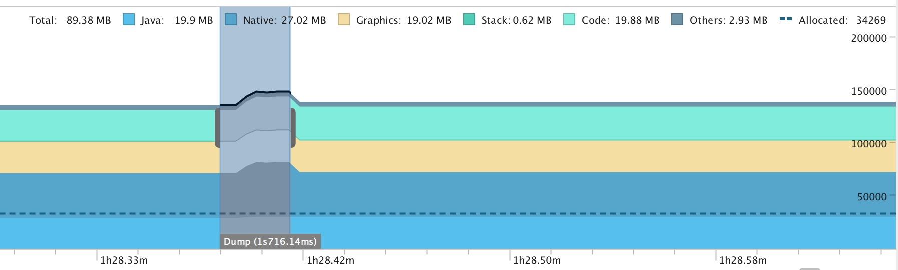
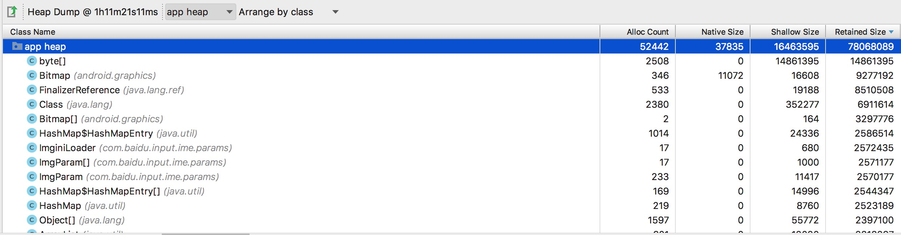

# 内存优化专项（第一阶段）

###### 进度

- 阶段一：分析九键打字情况下的内存，对比搜狗优化（*分析完成，计划排出*）
	1. 内核词库迁移到mmap
	2. 手写version接口不打开手写引擎
	3. 面板背景缓存图去除
	4. Graphics内存优化
	5. 代码段优化
- 阶段二：分析每个独立功能模块的内存使用情况（*等待分析*）

## 0. 先放结论

1. 主线7.7在不触发通知中心的情况下，九键打字内存比搜狗高约8MB。
2. 可以优化的点如下表，优化完后和搜狗内存基本相当：

| 优化点 | 降低内存      |  大致方案      |   复杂度
| ----- |:--------:|:-----------:|:-----------:|
| 面板背景缓存图  | 3MB | 不使用缓存图，每个键单独绘制 | 复杂 
| 通知中心获取手写模板版本 | 3.5MB       | 取版本时不加载手写模板 | 简单
| 通知中心游览器内核残留内存 | ~2MB    | 提交给游览器内核相关人员 | 未知
| 打字时内核内存持续上升 | 0-10MB    | 内核排查 | 未知
| 代码段内存占用高（约20MB） | 未知    | 代码解耦，启动流程优化 | 复杂
| 词库占用内存（含三维词库后约15MB） | 未知    | 内核优化 | 未知

## 1. 百度和搜狗对比

测量基于：

- 断网起面板后等待一段时间测量，正常打字一段时间后测量，联网后重启启动并且打字一段时间后测量（单位KB）
- 百度版本：主线7.7
- 搜狗版本：8.16

#### 断网刚启动时

| 名称 | 百度       |  搜狗      | 
| ----- |:--------:|:-----------:|
| Java  | 10912 | 8396 
| Native | 14136       | 12820
| Code | 21160    | 12896
| Stack | 292    | 212
| Graphics | 17296    | 15632
| Private Other | 3404    | 8140
| System | 5714    | 6788 
| Total | 72914    | 64884 

#### 打字后:

| 名称 | 百度       |  搜狗      | 
| ----- |:--------:|:-----------:|
| Java  | 12428 | 9776 
| Native | 16472       | 15100
| Code | 18164    | 7708
| Stack | 316    | 224
| Graphics | 19460    | 15864
| Private Other | 4904    | 13840
| System | 9091    | 9924 
| Total | 80835    | 72436 

#### 连网后：

| 名称 | 百度       |  搜狗      | 
| ----- |:--------:|:-----------:|
| Java  | 14960 | 11088 
| Native | 18632       | 15200
| Code | 17376    | 15452
| Stack | 600    | 244
| Graphics | 18532    | 18508
| Private Other | 4384    | 15060
| System | 10788    | 7940 
| Total | 85272    | 83492 

## 2. 百度输入法内存详细分析

在上述操作之后，触发通知中心，并且打字约3分钟左右后（期间中英文切换）测量：

### 2.1. JAVA

#### 静态内存 

java层总共持有约**19mb**内存，忽略系统内存占用后，app本身占用内存为**16.5mb**对象内存，

主要占用如下：

1. byte[]数组，占用约**14.86**mb ：这部分主要是缓存的图片，主要包括：
	1. 面板背景图：Keymap10.java中的imgBak，KeymapLoader中的bufferImg[0]（3mb+ 3mb）
	2. Cand条背景图：imgCandBack（560k）
	3. Cand条文字图：imgCandWords（488k）
	4. imgFlauncher（338k）
	5. mImgCandBack0（159k）
	6. srcImg in imgParam中若干20多k到30多k的图片
	7. ReCommendEmojiTab中的封面图（700k * 3）[误触触发到表情面板，可以忽略这些，但后续优化表情面板内存时需要考虑这个问题]

2. 皮肤加载部分持有了部分资源（200k）

3. 各种char[]数组，hashmap占用的资源（300k）

4. class占用的资源（300k）
 

#### 打字时瞬时内存

打字时瞬时内存会上升**5MB**左右，停止打字一段时间后，内存会释放。主要来自于：
1. 内核查询线程分配的各种char[]字符串（CoreThread）
2. inputbar与云输入浮层的showAtLocation调用分配的各种char[]字符串
3. 打字过程中出现的Emoji图片
4. CoreString占用内存

其中1，2两点会占用3mb左右，并且释放较慢

### 2.2. NATIVE

刚安装时，native内存占用**16mb**左右，触发通知中心后稳定在22mb左右（不含三维词库），随着打字过程，native内存占用会上升10mb左右。

1. 应用起来后自身会占用6mb左右内存
2. 词库占用内存：
	1. 系统词库 5.55mb
	2. 注音词库 1.98mb
	3. 其它文件 1.5mb
3. 长时间打字时，内核内存占用会逐步提升，提升量在10mb左右**（据了解是内核的索引缓存，这部分还需要分析具体原因）**

#### 通知中心导致的native内存增加

通知中心链接会增加**6mb**左右的native内存，初步看包括：

1. 游览器初始化后内核占用 接近2mb左右
2. PlHandWritingVersion调用增加 3.5mb左右
3. 其它so占用的内存（过程中需要打开熊头菜单，开发者模式，这两步增加约1mb，触发的so包括高斯模糊，加密，定位）

注：上述过程不下载三维词库

#### 三维词库影响

三维词库会在通知中心触发后，并且后台配置的情况下安装，增加内存为**6.68mb**

### 2.3. CODE

如果第一次安装，code部分常驻20mb左右（带有切换输入法界面）。如果重启后第一次启动，code部分常驻16mb左右（不带切换输入法界面）。

code部分的占用内存主要包括：

1. 主dex的内存占用（测试版本 dex大小为4.1mb）
2. so文件的内存占用（启动时load的so文件）
3. 使用功能时会用到dex文件（起面板、打字、通知中心链接）
4. 字体文件

## 3. 优化

### 3.1. 系统词库，三维词库，手写模板直接加载到内存改为加载到mmap

***主线7.7版本***
               
优化后（加载系统词库）：

| 名称 | 起面板       |  打字30秒      |  打字5分钟 | 断网起面板
| ----- |:--------:|:-----------:|:-----------:|:-----------:|
| Java  | 13500 | 16264 | 15084 | 11204
| Native | 9844       | 12020 | 13556 | 8044
| Code | 11560    | 12232 | 12976 | 10552
| Stack | 440    | 480 | 520 | 276
| Graphics | 17296    | 18588 | 20160 | 17296
| Private Other | 3952    | 5924 | 8780 | 3496
| System | 9809    | 9828 | 10142 | 9436
| Total | 66401    | 75336 | 81218 | 60304
               
***主线7.8版本***

优化前（起面板测两次，打字加载了系统词库+三维词库）：

| 名称 | 起面板（无三维词库）| 起面板（三维词库）|  打字（一场大雪）| 打字1分钟 
| ----- |:--------:|:-----------:|:-----------:|:-----------:|
| Java  | 14456 | 14368 | 14844 | 15120
| Native | 15632 | 23812 | 25308 | 27220
| Code | 11300    | 11056 | 11416 | 12696
| Stack | 436    | 428 | 476 | 504
| Graphics | 17552    | 17568 | 18412 | 18416
| Private Other | 4036 | 4056 | 4328 | 4556
| System | 8386    | 8166  |  8172 | 8382
| Total | 71798    | 79454 | 82956 | 86894

优化后（加载系统词库+三维词库，是否加载三维词库内存一样）：

| 名称 | 起面板       |  打字（一场大雪）      |  打字1分钟
| ----- |:--------:|:-----------:|:-----------:|
| Java  | 14044 | 14332 | 14604
| Native | 11004       | 13348 | 14072
| Code | 10968    | 11492 | 11748
| Stack | 420    | 572 | 508
| Graphics | 17292    | 18416 | 18428
| Private Other | 4080    | 9188 | 10768
| System | 7884    | 8203 | 8482
| Total | 65692    | 75551 | 78610

### 3.2. 通知中心去除手写词库version判断

### 3.3. 面板背景缓存图