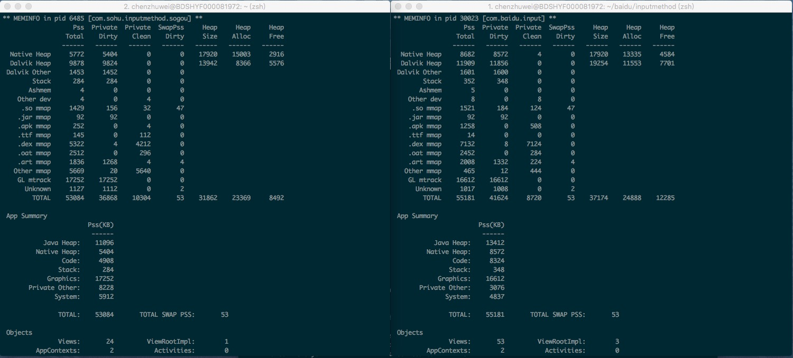
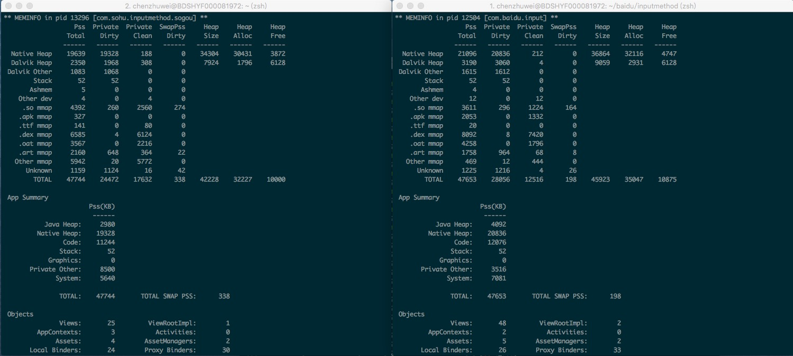
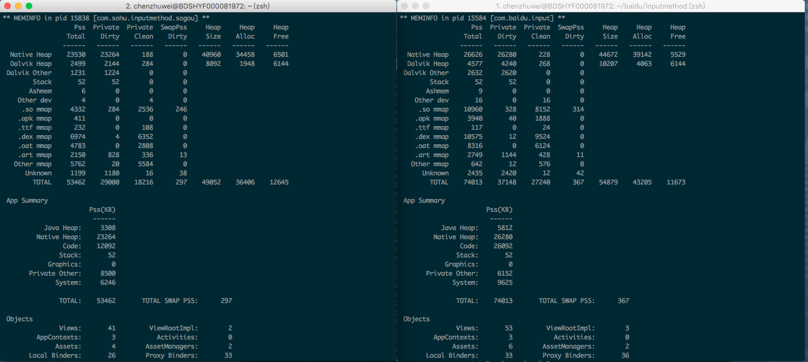
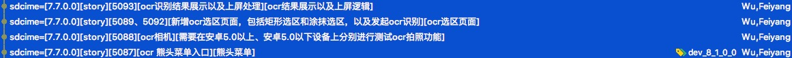
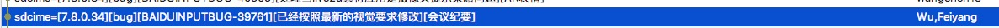

# 8.0版本全量内存分析

测试基于Huawei P9（root，android7.0），与Huawei Mate10（非root，android8.0）

## 0. 先放结论

## 1. 总体内存情况

P9：正常使用情况下，此时搜狗会有多个进程存在，下图仅是主进程内存占用


Mate10：输入法安装后多次切换输入法，确保没有额外后台任务情况下，再起面板，同时确保搜狗没有额外进程


Mate10：输入法安装后直接起面板，通过系统切换输入法，确保不进入商店


**注：百度输入法在安装后第一次起面板时，在mate10上存在so mmap内存高的情况，需要一台root的mate10来分析。**

## 2. code段内存（需要root分析，测试机型P9）

### 2.1. dex mmap内存

- 百度输入法：base.odex大小为15mb，初始化加载后内存占用约RSS=7mb，PSS=7mb
- 搜狗输入法（单一进程）：base.odex大小为16mb，初始化加载后内存占用约RSS=6.2mb，PSS=6.2mb
- 搜狗输入法（多进程）：base.odex大小为16mb，初始化加载后内存占用约RSS=6.2mb，PSS=5mb

**dex内存的优化空间主要在代码命名组织上，优化空间不大。**

**注：在Mate10上，安装后第一次起百度输入法，dex mmap占用10mb，搜狗只有7mb，需要进一步分析**

### 2.2. so mmap内存

- 百度输入法：pss占用约1.5mb
- 搜狗输入法：pss占用约1.3mb

**百度输入法多了libjnicrash(48k)，libchiperencoder_v1_2_1(32k)两个内存，其余均为系统so mmap内存，优化空间不大。**

**注：在Mate10上，安装后第一次起百度输入法，so mmap占用高达10mb，搜狗只有4mb，需要进一步分析**

### 2.3. apk mmap

- 百度输入法：pss占用约1.3mb，rss占用约2.3mb，size=3mb
- 搜狗输入法：pss占用约0.2mb，rss占用约0.5mb，size=0.5mb

**apk mmap需要继续分析**

### 2.4. code段内存详细分析

code段在7.7切换其它输入法后，使ImeApplication启动，后台内存占用4.2mb

1. +0.7mb：正常占用内存(占用0.7mb)
2. ???
3. +1.6mb：国际化sdk(占用2.6mb)
4. +1.4mb：OCR功能（占用4mb）[可以优化]

5. +0.2mb：7.6.5功能合入（占用4.2mb）
6. -0.6mb：如下代码引入(3.6mb) 

	```
	-keepclasseswithmembers class com.baidu.sofire.jni.Asc {*;}
	-keep class com.baidu.sofire.ac.Callback {*;}
	-keep class com.baidu.sofire.ac.FI {*;}
	-keepclasseswithmembers class com.baidu.sofire.ac.F{*;}
	-keep class com.baidu.sofire.ac.FH {*;}
	-keep class com.baidu.sofire.ac.U {*;}
	-keep class com.baidu.sofire.core.ApkInfo {*;}
	-keep class com.baidu.sofire.rp.Report {
	        <methods>;
	}
	-keep class com.baidu.cloudsdk.common.http.** {
	        *;
	}
	```
7. 0.3mb：InitImeData

	```
	
	```
8. +1.3mb：会议纪要功能引入（占用5.1mb，3.9->5.1）[可以优化]



## 3. dalvik内存（测试机型Mate10）

android 8.0开始，图片改为在native层加载，因此图片内存占用不再会出现在dalvik层。

### 3.1. 完全空规格

在安装后并多次切换输入法后再启动，确保所有安装任务与后台任务全部执行完成并且没有再启动：

- 百度输入法：dalvik内存占用约4.1mb
- 搜狗输入法：dalvik内存占用约3.0mb

**起面板后，百度输入法多加载了一个账号登录的html到内存中，占用约800k**

## 4. native内存（测试机型Mate10）

在安装后并多次切换输入法后再启动，确保所有安装任务与后台任务全部执行完成并且没有再启动：

- 百度输入法：native内存占用约21mb
- 搜狗输入法：native内存占用约19mb

输入法安装后直接起面板，通过系统切换输入法，确保不进入商店：

- 百度输入法：native内存占用约26mb
- 搜狗输入法：native内存占用约23mb

内存分布情况：

- app heap bitmap 占用约6.2mb
- **zygote heap bitmap 占用约6.8mb，这块需要分析原因**
- c层分配了10mb左右空间，需要分析分配者
- 空规格情况下，词库不占用内存