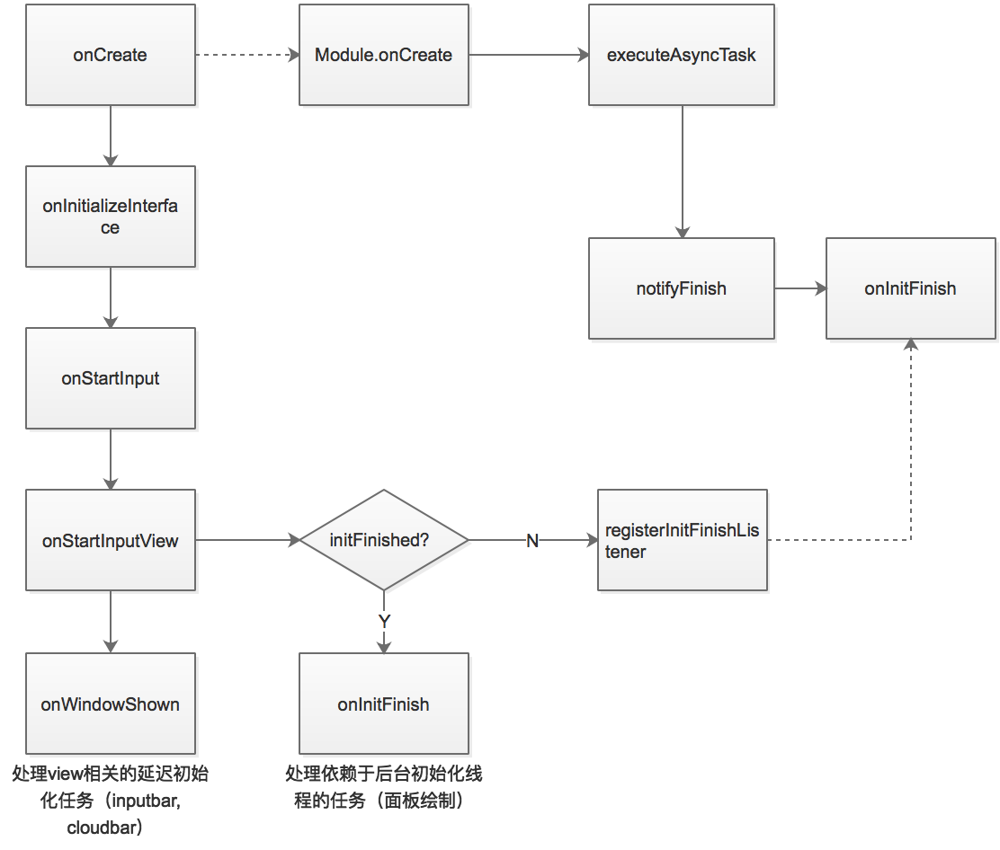
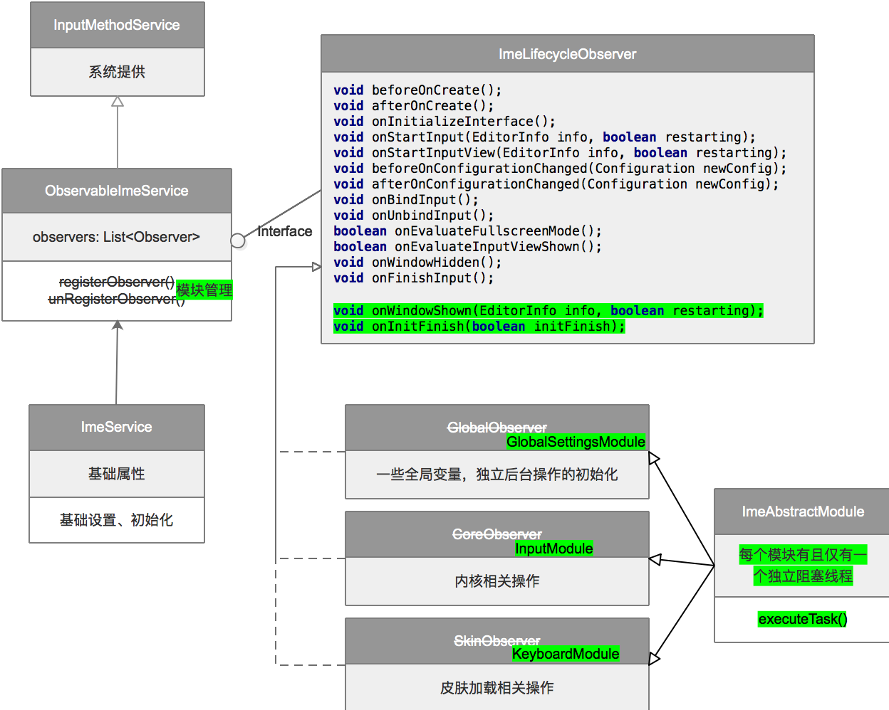

# 冷启动优化报告

## 0. 先放结论

Mate10上测试结果（搜狗冷启动关闭起面板动画，百度保留起面板动画，这部分耗时为150ms需要去除，讯飞存在进程保活策略，因此不存在冷启动）：

| 搜狗 | 讯飞  | 百度优化前 | 百度优化后
| ----- |:----------:|:-----------:|:-----------:|
| 914ms  |  常驻后台  |  1234 - 150 = 1084ms |  1024 - 150 = 874ms

## 1. 目标

冷启动时间优于或相当于竞品

## 2. 总体方案

1. 冷启动过程从**UI线程初始化**改为**多线程并发初始化**。
2. 梳理冷启动流程中的所有任务，调整任务执行的线程、延迟执行可懒加载的任务、去除过时或者无用任务。
3. 重构面板绘制部分，优化绘制性能。
4. 部分操作前移到Application.onCreate中。

**新启动流程**



## 3. ImeService重构解耦

### 我们要解决什么？

0. 冷启动异步化
1. ImeService、InputEventHandler越来越庞大
2. 模块间依赖（输入、面板、各种子功能...）
3. 异步线程、并发问题
4. 内存问题

### 重构思路：



#### 3.0. 模块化（模块安装、管理、调用）

v1：手动注册

```
private static ArrayMap<String , ImeAbstractModule> moduleMap = new ArrayMap<>();
public static <T extends ImeAbstractModule> void install(ObservableImeService service, Class<T> className);
public static <T extends ImeAbstractModule> T getModule(Class<T> className);
```

v2：annotation + 编译期注册，实例化 // TODO

```
@ImeModule
public class ImeXXXModule {}

@ImeModuleInstance
public ImeXXXModule instance;
```

目前已划分模块：

```
GlobalSettingsModule
InputModule
KeyboardModule
```

未来可以有 // TODO

```
SkinModule
SearchModule
ARModule
...
```

#### 3.1. 建立模块生命周期，规范生命周期中可处理的任务

v1：InputMethodService生命周期

```
void beforeOnCreate();
void afterOnCreate();
void onInitializeInterface();
void onStartInput(EditorInfo info, boolean restarting);
void onStartInputView(EditorInfo info, boolean restarting);
void beforeOnConfigurationChanged(Configuration newConfig);
void afterOnConfigurationChanged(Configuration newConfig);
void onBindInput();
void onUnbindInput();
boolean onEvaluateFullscreenMode();
boolean onEvaluateInputViewShown();
void onWindowHidden();
void onFinishInput();
...
```

v2：增加自定义生命周期

```
void onWindowShown(EditorInfo info, boolean restarting);
void onInitFinish(boolean initFinish);
```

v3：更多更细化的生命周期 // TODO

```
...
```

#### 3.2. 建立模块异步化框架，规范模块任务执行流程

***规定：每个模块有且仅有一个单线程异步阻塞线程池。***当该线程池执行完成全部任务后，会通知Service该模块初始化完毕，当所有模块都执行完成后，onInitFinish回调会被分发到各模块

```
public void executeTask(Runnable runnable) {
    moduleBlockThread().execute(() -> {
        initialTaskCount.addAndGet(1);
        runnable.run();
        initialTaskCount.addAndGet(-1);
    });
}

@CallSuper
@Override
public void onStartInputView(EditorInfo info, boolean restarting) {
    executeTask(this::notifyInitialFinished);
}
```

#### 3.3. 建立模块对外接口规范

v1：模块间调用直接通过类Public方法调用：

```
Module.getModule(ImeGlobalSettingsModule.class).updateHomePackages();
```

v2a：采用接口注册，强制模块间调用需要依赖接口

```
@ImeModuleInstance
public ImeGlobalSettingsModule instance;

@ImeModule
public class ImeGlobalSettingsModuleImpl implements ImeGlobalSettingsModule {

}
```


v2b：采用方法级注册，仅注册过的方法才可以被外部模块访问

```
@ImeModuleInstance
public ImeGlobalSettingsModule instance;

@ImeModule
public class ImeGlobalSettingsModule {
	
	@ImeModuleMethod
	public void doXXX();
}
```

#### 3.4. 建立模块监控机制

内存问题排查困难、内存泄露后无从得知、线程卡死后怎么办、某个模块产生崩溃是否可以不影响其它模块？

1. 全量内存监控（Bitmap、对象容器）
2. 主线程卡顿监控 -> 全线程卡顿监控
3. 组件化多进程/模块崩溃自动捕获、重启

## 4. 线程管理方案

预埋若干全局线程池，包括：

1. CoreThread：单线程线程池，处理内核相关操作
2. IOThreadPool：四线程线程池，处理I/O相关操作
3. BackgroundThreadPool：四线程线程池，处理各种后台操作
I