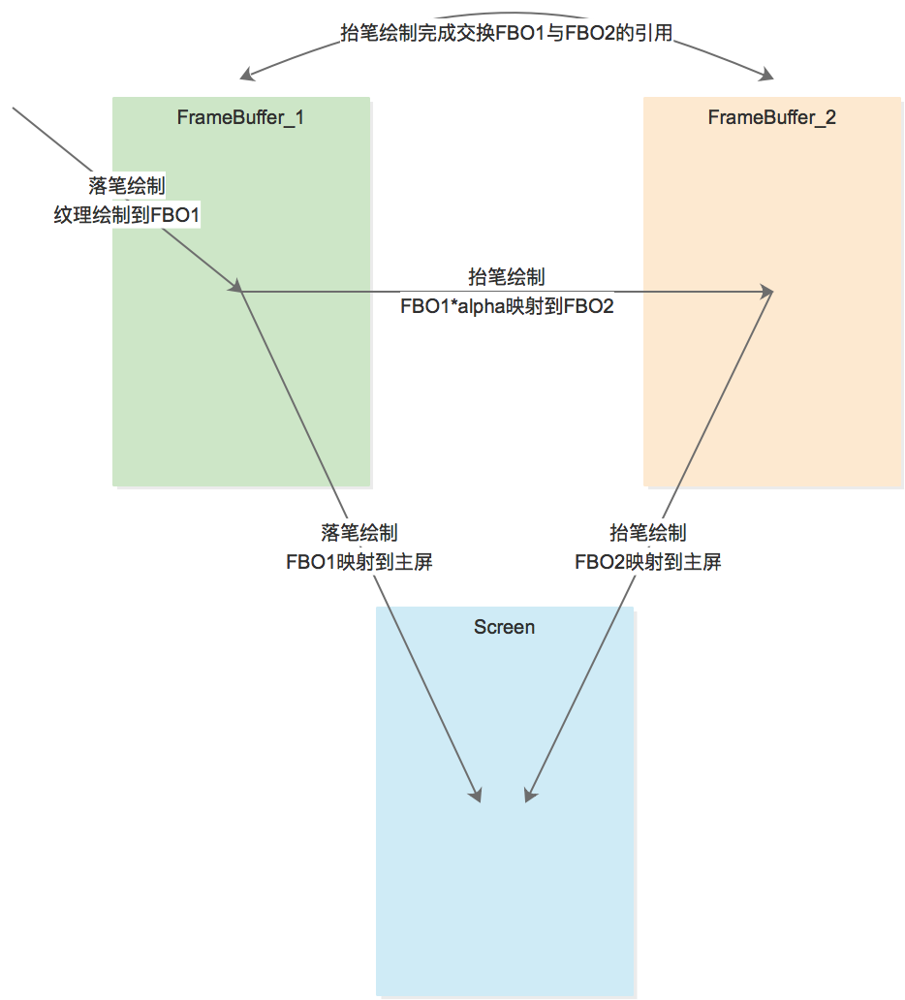

# 手写性能优化报告

## 0. 先放结论

### 优化前

|       |  平均每帧耗时 | 最大每帧耗时   | 实际体验效果 | 
| ----- |:----------:|:-----------:|:-----------:|
| 半屏 | 20.39ms  |  32.50ms  | 不随手，比较顺畅，笔锋正常
| 全屏 | 44.33ms  |  62.26ms  | 不随手，有卡顿感，笔锋正常

### 搜狗（搜狗的半屏实际可绘制大小只有约1/3屏幕）

|       |  平均每帧耗时 | 最大每帧耗时  |  实际体验效果 | 
| ----- |:----------:|:-----------:|:-----------:|
| 半屏 | 14.11ms  |  21.22ms  | 随手，顺畅，笔锋有问题，模糊
| 全屏 | 23.03ms  |  53.39ms  | 随手，顺畅，笔锋有问题，模糊

### 优化后

|       |  平均每帧耗时 | 最大每帧耗时  | 实际体验效果 | 
| ----- |:----------:|:-----------:|:-----------:|
| 半屏 | 15.74ms  |  19.65ms  | 随手，顺畅，笔锋正常
| 全屏 | 25.91ms  |  44.82ms | 随手，顺畅，笔锋正常

## 1. 背景

OEM厂商持续反馈手写卡顿问题，经分析问题原因是：
 
1. 笔锋效果绘制需要大量计算量
2. 轨迹绘制需要绘制大量贴图，通过java层调用canvas的绘制造成了大量重复绘制
3. 逻辑与绘制都在主线程，导致事件响应被卡住

## 2. 方案概述

- OpenGL独立线程渲染 + 双FBO离线缓存 + 增量渲染
- 采用线段渲染算法，解决用点渲染时在大幅度手写场景下渲染任务过重的情况。复杂度从O(N)降为O(T)，N为屏幕像素，T为屏幕刷新帧率

## 3. 架构设计

### 3.1. 类结构

### 3.2. 绘制流程

