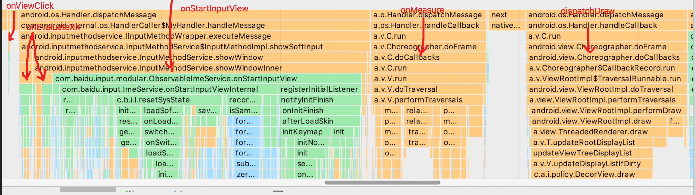
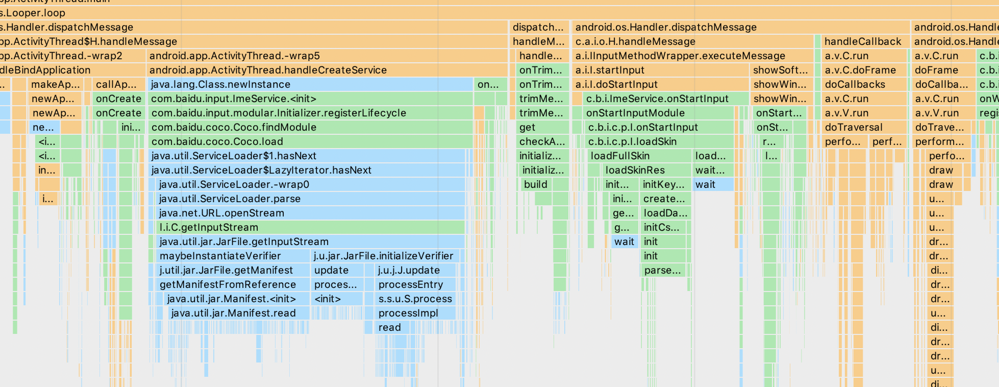
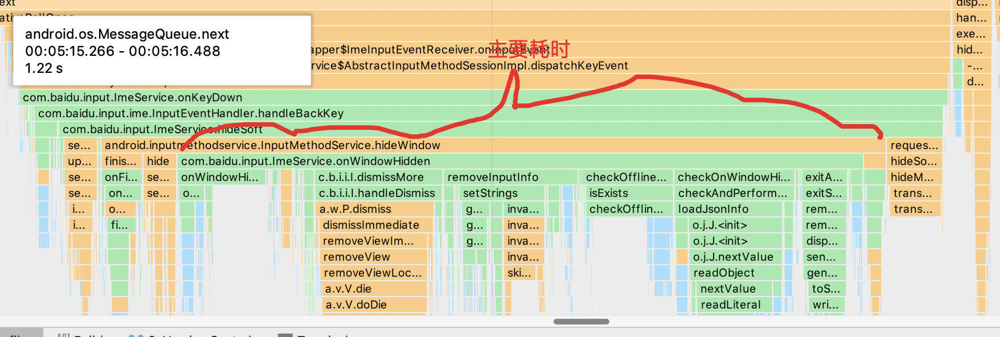

# 输入法性能优化专题--计划、分析、排期

## 1. 版本问题数据总览

###### 注：黑色代表已经优于或持平搜狗，蓝色代表优于或持平搜狗但仍有优化空间，黄色代表略差于搜狗需要考虑改进，红色代表差于搜狗必须改进。

### 8.2时期测试

|测试场景|百度输入法华为版V8.2.6.0|搜狗输入法V8.19|讯飞输入法V8.0.6589|优化目标|方案|
|---|---|---|---|---|---|
|26键汉字候选词响应|159|133|216|持平搜狗|各种气泡统一到相同浮层，8.3测试与搜狗一致|
|热启动|464|372|381|持平搜狗|分析之后与搜狗一致|
|拼音9键切符号面板|266|248|161|超过搜狗，争取持平讯飞|修改方案，从浮层改为面板，减少浮层启动时间|
|拼音9键切数字面板|210|171|146|持平搜狗|待进一步分析，8.3测试与搜狗一致|
|冷启动（切换输入法）|877|850|无|超越搜狗|重写Serviceloader增加冷启动速度，皮肤文件预编译+MMAP（默认皮肤硬编码？），硬键盘等待耗时，减少系统远程调用，SharedPreference加载优化，分dex优化|
|删除上屏字符|170|173|149|保持优于搜狗|理论上和搜狗只是误差，和讯飞的差异需要进一步分析，策略上存在明显差异，例如数据统计，Sug，云输入等获取光标前内容|
|常驻内存|98.51|109.33|70.7|保持优于搜狗|不让AR等功能引入新问题|
|使用态CPU|3.03%|3.28%|2.70%|保持优于搜狗|不让输入引入CPU问题|

### 8.3时期测试

|测试场景|百度输入法V8.3.0.5|搜狗输入法V8.24|讯飞输入法V8.1.7623|优化目标|方案|
|---|---|---|---|---|---|
|空规格内存|67.61|84.97|90.31|保持优于搜狗|AR SO加载时机优化，内核词库加载优化，ServiceLoader加载优化|
|开机内存|43.21|37.59|45.74|持平搜狗|重写Serviceloader降低内存，全面排查内存占用情况，分dex优化|
|空闲态CPU|0.05%|0.01%|0.00%|持平搜狗|分析之后与搜狗一致|
|热启动|433|414|386|持平搜狗|分析之后与搜狗一致|
|9键中文候选|151|168|188|保持优于搜狗，不差于之前版本|分析之后与之前版本一致|
|26键英文候选|159|142|174|持平搜狗|待进一步分析|
|收面板|319|293|351|持平搜狗|待进一步分析|

## 2. 问题分析与优化方案

### 2.1. 热启动

结论：与竞品相当，优化空间小，优化难度中，低优

QA测试case下的热启动流程：

1.用户点击 -> 2.onViewClick响应 -> 3.onEvaluateXX -> 4.onStartInputView -> 5.onMeasure -> 6.dispatchDraw -> 7.开始起面板 -> 8.面板完全展现

QA计算时间为1-8总时间，其中属于输入法可以控制的逻辑为2-7，1-2与7-8的时间由系统决定。其中7-8是系统固定动画耗时，所有输入法理论值固定且相等，如有误差均为测试误差。

下图是QA最新测试结果的一个详细数据，可见总耗时与竞品的差距并不大，统计1-7耗时，我们的输入法比搜狗输入法低**8ms**（1-7耗时横向对比最精确，参考意义最大）。统计2-7耗时，我们的输入法比搜狗输入法低17ms（2-7耗时统计并不一定准确，参考意义低）。

|测试项|百度输入法8.2.1.33|百度输入法V8.3.0.5|搜狗输入法V8.19|搜狗输入法V8.24|
|---|---|---|---|---|---|
|1-8总耗时|429ms|430ms|423ms|427ms|
|1-7总耗时|无数据|296ms|无数据|304ms|
|2-7总耗时|无数据|54ms|无数据|71ms|

在同样环境下我们通过打点的方式得到2-7的数据在60-100ms左右，下图给出于2-7中的耗时详细分析，主要的耗时点在onStartInputView调用中，onMeasure基本是系统耗时，dispatchDraw中系统耗时与我们代码耗时占用相当。

而一次起面板中onStartInputView中的耗时占用基本在20-50ms之间，可做优化项如下：

1. recordUserAction延迟到onWindowShown调用，可优化2-5ms
2. 使用MMKV替代sharedpreference、Option优化性能，可优化2-3ms
3. SmartReply.checkIsSwitchOn调用逻辑优化，可优化0-1ms
4. 使用其他方案替代getScaledEmojiImg，可优化0-1ms
5. 统一权限检查，可优化1-5ms

这些优化项对整体耗时优化的力度有限，并不能起到很大作用。

### 2.2. 冷启动（切换输入法）

结论：与竞品差距小，优化空间大，优化难度高，高优

QA测试case下的冷启动的主要流程如下：

1.点击切换输入法，前一个输入法收起 -> 2.加载输入法APK -> 3.Application初始化 -> 4.ImeService.onCreate -> 5.ImeService.onInitializeInterface -> 6.ImeService.onStartInput -> 7.ImeService.onStartInputView -> 8.onMeasure - > 9.dispatchDraw -> 10.开始起面板 -> 11.面板完全展现

QA计算时间为1-11总时间，其中属于输入法可以控制的逻辑为2-10，1-2与10-11的时间由系统决定。其中10-11是系统固定动画耗时，所有输入法理论值固定且相等，如有误差均为测试误差，**比较特殊的是搜狗输入法关闭了冷启动的动画，因此不存在10-11的耗时**。

下图是QA最新测试结果的一个详细数据，可见统计总耗时我们比竞品高56ms，统计1-10耗时，我们的输入法比搜狗输入法**低65ms**（1-10耗时横向对比最精确，参考意义最大）。

|测试项|百度输入法8.2.1.33|百度输入法V8.3.0.5|搜狗输入法V8.19|搜狗输入法V8.24|
|---|---|---|---|---|---|
|1-11总耗时|1024ms|1165ms|无数据|1109ms|
|1-10总耗时||1015ms||1080ms|

在同样环境下我们通过打点的方式得到3-10的数据在600-700ms左右，下图给出该耗时详细分析，主要的耗时点有。

这个流程里我们确定可以进行优化的项有：

1. ServiceLoader加载耗时优化，可优化50-100ms
2. 皮肤相关资源加载优化，默认皮肤进行hardcode，可优化50-100ms
3. app信息数据收集延迟，可优化10ms

这些优化项可以有效降低冷启动耗时，但是优化难度较大，需要较长时间处理。

### 2.3. 空规格内存

结论：优于竞品但是有优化空间，优化难度中高，高优

主线8.3相比主线8.2空规格内存增长点如下：

1. Java层：组件化serviceloader引入约2mb

	ServiceLoader的修复会与冷启动一起进行，理论上可以减低2mb
	
2. Native层：增长内存约1.5mb，具体原因待分析

	待分析

3. Code/Other段：内核词库加载方式改为assets+mmap导致code段内存上涨4mb，

	该增长本质原因是8.3使用了cz3新版本词库，该词库内核需要在映射后马上扫描整个词库建立映射表，8.2使用的cz2版本词库没有这个操作。因此会增长4mb，该增长量正好相当于cz3词库大小。需要内核进行修复。修复方案由内核确认。

4. 其他：代码量增长导致的dex mmap, oat mmap增长数百kb

	修复方案：无

5. 不影响测试结果，但是用户实际使用中会出现的内存增长：AR表情读取版本号导致约8mb上升

	修复方案版本号独立于so之外，下个版本修复
	
### 2.4. 开机内存

结论：差于竞品单进程，优于竞品多进程，优化难度中高，高优

开机内存的增长点与空规格基本一致，优化方案也基本一致。

比较特殊的是，搜狗开机内存有时只有一个进程，有时会有两个甚至多个进程，这方面导致其总内存占用差距很大，8.3.0.5给出的测试结果中，搜狗只有一个进程。

下图数据给出了QA最新的测试结果：

|测试项|百度输入法V8.3.0.5|搜狗输入法V8.24单进程|搜狗输入法V8.24多进程|
|---|---|---|---|---|---|
|第一次|55.17|43.04|56.95|
|第二次|54.07|42.88|57.98|
|第三次|51.88|42.81|56.87|
|均值|53.71|42.91|57.27|

**开机内存占用分布需要进一步分析，来寻找可优化空间，确认是否能达到搜狗单进程的表现。**

### 2.4.X 内存优化探索方案

对于所有内存情况的一些可行的优化方案：

1. resource.arsc混淆，预期降低约1mb
2. 代码混淆改进
3. APP Record Info Time List去除，预期降低约600k-800k
4. 图片优化

对于所有内存情况一些需要再探索的方案：

1. 分dex，主dex轻量化，优化开机内存，甚至空规格内存

### 2.5. 收面板

结论：比竞品略差，在浮动误差范围内，优化空间几乎无，优化难度高，低优

QA测试case下的收面板流程：

1.用户点击 -> 2.系统触发keyevent -> 3.输入法onKeyDown响应 -> 4.onWindowHidden -> 5.系统hideSelf -> 5.系统hideSoftInput -> 6.开始收面板 -> 7.面板完全收起

QA计算时间为1-7总时间，其中属于输入法可以控制的逻辑为3-4，剩余时间由系统决定。其中6-7是系统固定动画耗时，所有输入法理论值固定且相等，如有误差均为测试误差。

下图是QA最新测试结果的一个详细数据，总耗时比搜狗输入法高26ms，统计1-6耗时，比搜狗输入法高**8ms**（1-6耗时横向对比最精确，参考意义最大）。可见我们与搜狗的真正耗时差距很小，在误差范围内。

|测试项|百度输入法8.2.1.33|百度输入法V8.3.0.5|搜狗输入法V8.19|搜狗输入法V8.24|
|---|---|---|---|---|---|
|1-7总耗时|413ms|433ms|无数据|414ms|
|1-6总耗时|无数据|188ms|无数据|180ms|

在同样环境下我们通过打点的方式得到3-4的数据在20-60ms左右，下图给出于2-5中的耗时详细分析，主要的耗时点在onWindowHidden调用中，其内部调用的一些耗时相对比较平均。

而一次起面板中onKeydown中的耗时占用基本在20-60ms之间，可做优化项如下：

1. recordUserAction不再调用，可优化1-5ms
2. 使用MMKV替代sharedpreference、Option优化性能，可优化0-1ms

这些优化项对整体耗时优化的力度有限，几乎无法起到作用。此外收面板可控的代码耗时占比本来就低，因此基本没有优化空间。

### 2.6. 空闲态CPU

结论：与竞品相当，多数情况下均为0，优化空间几乎无，优化难度高，低优

目前大多数情况下百度输入法的空闲态CPU均为0，存在测试结果差的原因时，某一时间点正好存在后台请求（如通知中心），这会给测试结果带来剧烈影响。其实与搜狗的空闲态CPU一样基本均为0，这种波动如果情景不强烈建议修复

输入法启动后，所使用的线程总数为61条，这部分需要查找可优化空间。

### 2.7. 9键中文候选

结论：与8.2版本一致，不用优化

用8.3.0.10灰度正式版本与8.2线上正式版本进行对比。把点击操作分成down与up两个部分，进行两部分数值累加，作为整体的点按时间。

1. 8.3.0.10版本 down的平均值是24.72ms,up的平均值是58.909ms
2. 8.2线上版本 down的平均值是22.6ms，up的平均值是54.4ms

从两者的分析流程来看，流程也是相同的，两个版本并没有明显时间以及流程上的差异。QA的策略结果，我们认为是在误差范围内。并且QA的测试方法，其实是把从点按到没有抬手的过程中，停留的时间也被记录进去，这部分停留没有抬手的时间，也会造成总的时间增大。

### 2.8. 拼音9键切符号面板

结论：目前与竞品相当，但是方案可以从浮层方案改为面板方案，可以大幅优化耗时

### 2.9. 删除上屏字符

待分析

### 2.10. 26键英文候选

待分析

## 3. 排期规划

|优化项|收益|排期|负责人|
|---|---|---|---|---|
|ServiceLoader方案重写|降低所有内存项、冷启动时间|8.3update|陈朱伟|
|APP Record Time Info优化|降低所有内存项、冷启动时间|8.3update|陈朱伟|
|AR表情SO内存|降低所有内存项|8.3update|苑冰泉|
|内核词库加载内存|降低所有内存项|未确定|内核|
|MMKV方案替代SP|降低冷启动时间、热启动时间|8.4|陈朱伟|
|热启动相关其他细节问题优化|降低热启动时间|8.4|陈朱伟|
|resource.arsc混淆|降低所有内存项，包大小|8.4|陈朱伟|
|代码混淆优化|降低所有内存项，包大小|8.4|陈朱伟|
|图片资源加载优化|降低所有内存项|8.4|陈朱伟|
|开机内存、空规格内存进一步排查分析|降低所有内存项|8.4|陈朱伟|
|符号面板从浮层改为面板|降低拼音9键切符号面板耗时|8.4或以后|夏涵|
|默认皮肤加载优化|降低冷启动时间|8.4或以后|夏涵|

## 4. 其他规划

### 性能排查工具规划

1. Code段内存排查工具，基于smaps，帮助排查目前code段内存占用比重较大的问题
2. Native内存排查工具，帮助排查native内存问题
3. 内存自动测试脚本

### 崩溃与卡顿问题

#### Flywheel3.0

1. 强化短阈值卡顿监控能力
2. 增加系统ANR收集，由于卡顿监控方案存在一定性能损耗，release版本上会改用系统ANR收集
3. 卡顿/ANR/崩溃上传机制优化，提升数据回传率
4. 重写native崩溃收集，提升崩溃收集能力
4. 效果数据埋点（回传率、收集率）

#### 线上崩溃卡顿

1. 线上卡顿（卡顿率降低到1%以下）
2. 崩溃（崩溃率降低到0.1%以下）

#### ShowX监控平台

1. Showx与icafe打通，展示优化（服务器端工作）
2. mapping文件反扰码支持（客户端提供脚本）
3. 堆栈聚类支持（客户端提供脚本）

### 编译期优化

1. 分dex方案：提升首次启动速度，降低首次启动内存
2. proguard优化：降低包大小
3. resource.arsc扰码：降低包大小

### 包大小过大

1. 表情采用静默下发；AR相关功能，静默下发；内置词库格式优化等
2. 屏幕适配方案优化：去除不必要资源文件
