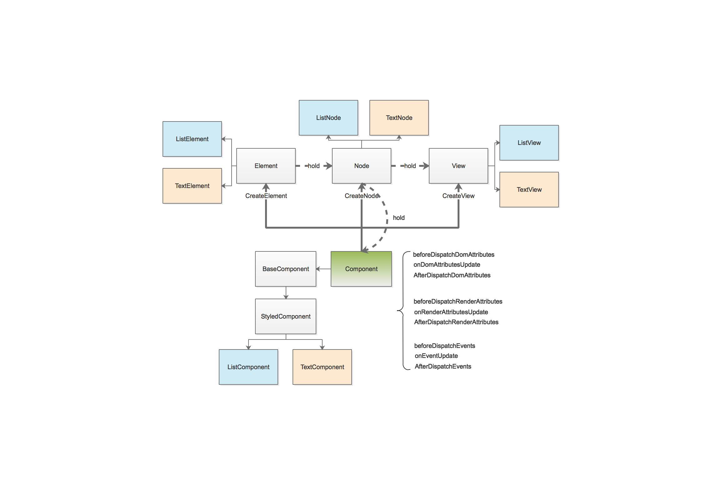

#Mint跨平台动态模板框架

## 解决的问题：

输入法想通过前端动态化技术进行一些界面的开发，但是React Native存在若干问题：包括

1. 包体积过大
2. 内存占用高
3. 必须依赖Activity
4. 当存在多个react instance的时候性能损耗严重
5. android/ios双端开发不统一

## 优势：

1. 前端容易开发：原生Html/CSS/JS，支持跨平台，前端MVVM，数据绑定，组件化
2. 渲染性能优于ReactNative，包体积、内存、渲染速度均超过React Native
3. 支持多instance，通过JS Runtime内部隔离，避免性能问题

## 性能与功能对比

相比React Native，Mint主要做了三方面优化。

1. Mint放弃了比较重的React JS前端框架，前端只保留通信协议解析能力，牺牲了一部分扩展性和前端框架的前提下极大地提升了性能。
2. 得益于V8引擎的性能与J2V8高效的内存映射通信模式，Mint也有效地降低了JS与Native的通信代价。
3. 在渲染层面上，Mint引入了增量渲染保证了在节点更新时，Mint只需要重新渲染有变更的节点。此外还实现了view层级合并算法，有效降低了因Flex布局形式导致的复杂视图的view层级数目。

如下是具体的对比数据：

### 性能对比

| 名称 | React Native 0.49       |  Mint       | 优化百分比
| ----- |:--------:|:-----------:|:-----------:|
| 包体积（编译压缩后）  | 7.4Mb 含JS Core引擎1mb | 4.5Mb 含v8引擎3.4mb | 降低 39%
| 内存占用 | 23.2Mb       | 13.6Mb | 降低41%
| 首屏渲染（Helloworld）| 321ms    | 70ms | 降低78%
| 首屏渲染（list 50条数据）| 577ms    | 129ms | 降低77%
| 帧率 | 59    | 60 | 相当

### 功能对比

| 名称 | React Native 0.49       |  Mint       |
| ----- |:--------:|:-----------:|
| 组件生态 | 好    | 差
| 扩展性 | 可在前端封装组件    | 只能通过Native端封装组件
| 打包 | JS Bundle | 原始Html + JS文件
| 调试 | 支持Chrome调试 | 暂时不支持
| 异步 | 支持Promise | 只支持Callback

### 技术方案对比

| 名称 | React Native 0.49       |  Mint       |
| ----- |:--------:|:-----------:|
| 前端开发 | React JS    | 原生Html + JS + 数据绑定
| JS Bridge | 字节流通信 | JNI层直接内存映射
| 布局 | 基于Yoga布局库 | 基于Yoga布局库
| Dom Differ | React JS实现 | Native渲染引擎实现
| 渲染 | 单节点逐一渲染 | View Tree统一增量渲染 + view层级合并

## 技术框架

### 1. 总体框架

Mint包括 Front End、JS Bridge、Native Runtime三部分。其中Front End提供了前端开发框架，处理Java层数据、接口的封装与解析。JS Bridge负责JS与Native的通信。Native Runtime负责模板解析、编译、渲染、以及Native端能力的提供。总体架构图如下所示：

对于一个前端模板的处理，Mint会将Html文件转换成Dom Tree结构，最终渲染成真正的View Tree。

### 2. JS Bridge通信技术方案

Mint基于V8引擎与J2V8封装提供了JS层与Native层的无缝调用技术，实现了在JS层可以任意访问Native的对象与接口。其技术框架如下：

### 3. 前端数据绑定方案

Mint采用类似于Angular的数据绑定方案，使用`{{}}`标签实现数据绑定，但是对于标签的解析放于Native端处理，实现更优的性能。

### 4. 线程模型

Mint使用三线程模型，包括JS线程、Process线程、UI线程

### 5. Render技术方案

Mint采用异步布局+同步渲染的方案，其流程图如下：

### 6. UI Component组件技术方案

Mint支持自定义UI组件扩展，UI组件设计方案如下：

